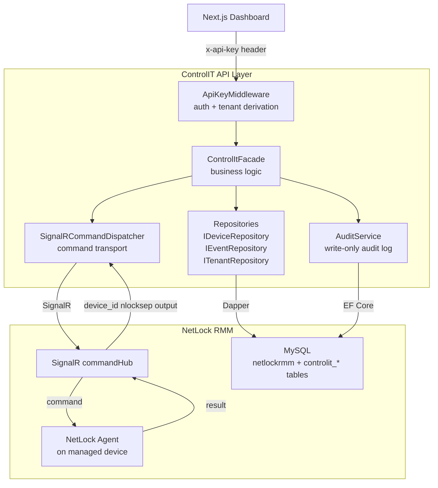
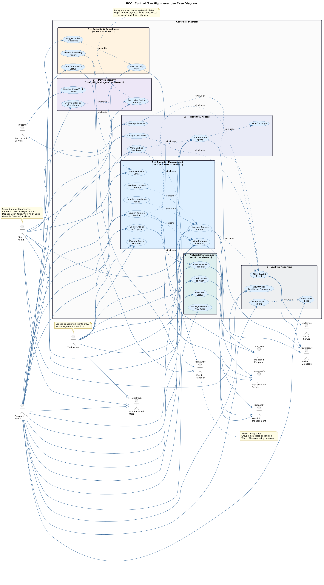

# ControlIT - NetLock RMM API Layer

ControlIT is a typed REST API layer built on top of NetLock RMM, designed for managed service providers who need programmatic access to their endpoint fleet without calling NetLock's internal APIs directly. It reads from NetLock's MySQL database, dispatches real-time commands through its SignalR hub, and adds its own tenant management and audit trail tables to the shared database.

This repo contains the ASP.NET Core API, the local Docker stack for running NetLock RMM on Apple Silicon, and a Debian Lima VM for agent testing.

For production-demo setup, generated credentials, one-time migrations, NetBird modes, and rotation steps, see [RELEASE.md](RELEASE.md).

---

## Installation / Alpha Release

Use the [`production`](https://github.com/mahir-m01/NetLock-RMM-API-Layer/tree/production) branch for alpha release setup, Docker Compose files, generated credentials flow, and install instructions.

This `main` branch is kept as the project overview branch with architecture notes, diagrams, and development context.

---

## Architecture



### Use Case Overview



---

## What it does

- Lists and filters managed endpoints across all client tenants
- Dispatches remote shell commands to endpoints in real time via NetLock's SignalR hub
- Correlates command responses by `device_id` - one pending command per device, 409 on collision
- Enforces tenant isolation at every query - all data is scoped to the authenticated tenant
- Maintains a full audit log for every command attempt (DPDP Act 2023)
- Provides a dashboard summary with live online device counts

Current alpha covers NetLock RMM plus NetBird network visibility/enrollment paths. Wazuh remains Phase 2.

---

## Stack

| Layer | Technology |
|---|---|
| API runtime | ASP.NET Core 10 - Minimal APIs |
| NetLock reads | Dapper + MySqlConnector |
| ControlIT tables | EF Core + Pomelo |
| Real-time commands | Microsoft.AspNetCore.SignalR.Client |
| Database | MySQL 8.0 (shared with NetLock) |
| Auth | SHA-256 hashed API keys - tenant derived from DB, never from request |

---

## API Endpoints

[](https://app.getpostman.com/run-collection/48552836-8ec181d0-6951-4946-bc7a-9e55f4bc7fd0)

| Method | Path | Description |
|---|---|---|
| GET | `/health` | Service health - MySQL and SignalR status |
| GET | `/devices` | Paginated device list with optional filters |
| GET | `/devices/{id}` | Single device detail |
| GET | `/dashboard` | Summary counts - total, online, events |
| GET | `/events` | Paginated event log |
| GET | `/tenants` | Tenant list |
| POST | `/commands/execute` | Dispatch shell command to a device via SignalR |
| GET | `/audit/logs` | Audit trail query with date range and pagination |

The Postman collection includes all 18 requests with test scripts, pre-configured query params, and request bodies. After importing, select the **Local Dev** environment and set `base_url` to `http://localhost:5290` with your API key.

---

## Project Structure

```
NetLock-RMM-API-Layer/
- src/ControlIT.Api/
  - Application/       Facade, TenantContext, AuditService, Notifications
  - Domain/            Interfaces, Models, DTOs
  - Infrastructure/    MySql repositories, NetLock SignalR service, EF context
  - Endpoints/         Minimal API route handlers
  - Common/            Middleware (ApiKeyMiddleware, ErrorHandlingMiddleware)
  - Migrations/        EF Core migrations for controlit_* tables
- tests/ControlIT.Api.Tests/
  - Unit/              SignalRCommandDispatcher, TenantContext
  - Integration/       Health endpoint via WebApplicationFactory
- diagrams/            UML diagrams - render on GitHub
- docker-compose.yml   Local NetLock RMM stack
- debian-test.yaml     Lima VM for local agent testing
```

---

## Diagrams

| Diagram | Description |
|---|---|
| [UC1 - Overall System](diagrams/uc1-overall.md) | All actors and use cases across the full platform |
| [UC2 - API Layer](diagrams/uc2-api-layer.md) | REST endpoints, middleware, and external integrations |
| [Class Diagram](diagrams/class-01-netlockrmm.md) | OOP structure, interfaces, and design patterns |
| [ER Diagram](diagrams/er-01-netlockrmm.md) | Database schema - NetLock tables and ControlIT owned tables |
| [Sequence - Execute Command](diagrams/seq-01-execute-command.md) | Full flow for `POST /commands/execute` |

---

## Local Development

### Prerequisites

```bash
brew install colima docker docker-compose
```

Wire the Compose plugin to Docker CLI (one-time):

```bash
mkdir -p ~/.docker/cli-plugins
ln -sfn /opt/homebrew/opt/docker-compose/bin/docker-compose ~/.docker/cli-plugins/docker-compose
```

### Containers

| Container | Image | Port | Purpose |
|---|---|---|---|
| `mysql-container` | `mysql:8.0` | `3306` | Database (native arm64) |
| `netlock-rmm-server` | `nicomak101/netlock-rmm-server` | `7080` / `7082` | Backend |
| `netlock-rmm-web-console` | `nicomak101/netlock-rmm-web-console` | `8080` | Blazor admin UI |

The two NetLock images are amd64-only and run under Rosetta 2 emulation via Colima. MySQL runs natively on arm64.

### Start Colima

Run after every Mac restart:

```bash
colima start --arch aarch64 --vm-type vz --vz-rosetta --cpu 4 --memory 6
```

### Start the stack

```bash
./scripts/setup-controlit-env.sh
docker compose up -d
```

Allow 2-3 minutes on first boot. MySQL runs a healthcheck before NetLock containers start.

ControlIT production/demo runtime uses a least-privilege database user. Run EF migrations once with privileged credentials, then create/use the runtime user:

```bash
./scripts/run-controlit-migrations.sh
./scripts/apply-controlit-db-user.sh
docker compose -f docker-compose.controlit.yml up -d --build
```

### Run the API

```bash
dotnet run --project src/ControlIT.Api/ControlIT.Api.csproj --launch-profile http
```

### Access

| Service | URL |
|---|---|
| ControlIT API | http://localhost:5290 |
| NetLock Web Console | http://localhost:8080 |
| NetLock Server | http://localhost:7080 |

---

## Test Agent - Debian Lima VM

A Debian 12 (ARM64) Lima VM for testing the NetLock Linux agent locally.

```bash
brew install lima
limactl start debian-test.yaml
limactl shell debian-test
```

Inside the VM, download the installer from the NetLock web console at `http://localhost:8080`. Set server fields to `192.168.5.2:7080` and relay to `192.168.5.2:7082`. The agent will appear in the console under the selected tenant.

`192.168.5.2` is Lima's fixed host gateway - always resolves to the Mac from inside any Lima VM.

---

## Troubleshooting

**`docker compose` not found**
```bash
mkdir -p ~/.docker/cli-plugins
ln -sfn /opt/homebrew/opt/docker-compose/bin/docker-compose ~/.docker/cli-plugins/docker-compose
```

**Cannot connect to Docker daemon** - Colima is not running:
```bash
colima start --arch aarch64 --vm-type vz --vz-rosetta --cpu 4 --memory 6
```

**Web console error on first load** - MySQL is still initialising. Wait 60 seconds and refresh.

**Port conflict on 8080 or 7080**
```bash
lsof -i :8080
```

**Slow NetLock containers** - Expected under Rosetta 2 emulation. Deploy on a Linux x86-64 host for production.
