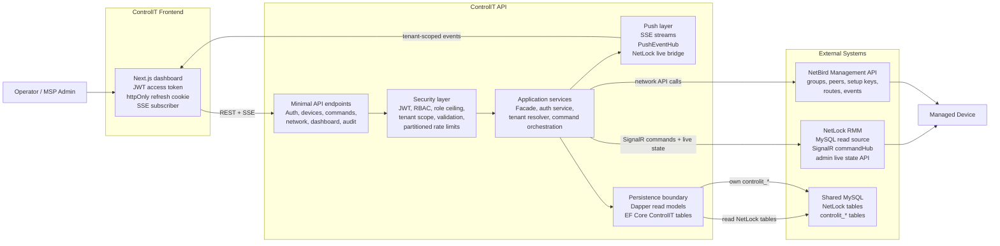

# ControlIT - NetLock RMM API Layer

ControlIT is an alpha API and dashboard layer built on top of an existing NetLock RMM installation. It gives MSP-style operators a typed, tenant-scoped control plane for devices, command execution, live dashboard updates, user/RBAC management, audit history, and NetBird network visibility without forking or rewriting NetLock.

NetLock remains the endpoint-management source of truth. ControlIT reads NetLock-owned tables through adapters, dispatches commands through NetLock SignalR, bridges live NetLock state into ControlIT push events, and writes only ControlIT-owned `controlit_*` tables.

For the clean alpha release package and install instructions, use the [`production` branch](https://github.com/mahir-m01/NetLock-RMM-API-Layer/tree/production). `main` and `dev` keep the full project context, architecture diagrams, development notes, and review assets.

---

## Architecture Showcase


```mermaid
graph LR
    Operator["Operator / MSP Admin"]
    Device["Managed Device"]

    subgraph "ControlIT Frontend"
        Web["Next.js dashboard<br/>JWT access token<br/>httpOnly refresh cookie<br/>SSE subscriber"]
    end

    subgraph "ControlIT API"
        Endpoints["Minimal API endpoints<br/>Auth, devices, commands,<br/>network, dashboard, audit"]
        Security["Security layer<br/>JWT, RBAC, role ceiling,<br/>tenant scope, validation,<br/>partitioned rate limits"]
        Services["Application services<br/>Facade, auth service,<br/>tenant resolver, command orchestration"]
        Push["Push layer<br/>SSE streams<br/>PushEventHub<br/>NetLock live bridge"]
        Persistence["Persistence boundary<br/>Dapper read models<br/>EF Core ControlIT tables"]
    end

    subgraph "External Systems"
        NetLock["NetLock RMM<br/>MySQL read source<br/>SignalR commandHub<br/>admin live state API"]
        NetBird["NetBird Management API<br/>groups, peers, setup keys,<br/>routes, events"]
        MySQL["Shared MySQL<br/>NetLock tables<br/>controlit_* tables"]
    end

    Operator --> Web
    Web -->|"REST + SSE"| Endpoints
    Endpoints --> Security
    Security --> Services
    Services --> Persistence
    Services --> Push
    Persistence -->|"read NetLock tables"| MySQL
    Persistence -->|"own controlit_*"| MySQL
    Services -->|"SignalR commands + live state"| NetLock
    Services -->|"network API calls"| NetBird
    Push -->|"tenant-scoped events"| Web
    NetLock --> Device
    NetBird --> Device
```

### High-Level Use Case


---

## What ControlIT Adds

| Area | Current alpha behavior |
|---|---|
| Auth | JWT access tokens, httpOnly refresh cookies, password reset/change flows, bootstrap SuperAdmin |
| RBAC | `SuperAdmin`, `CpAdmin`, `ClientAdmin`, `Technician` policies with role ceiling and tenant boundaries |
| Devices | Tenant-scoped inventory, filtering, metrics, NetBird IP/mapping display |
| Commands | Single-device and batch command execution through NetLock SignalR, one pending command per device |
| Dashboard | Snapshot endpoint plus SSE-only push stream for device/system/command updates |
| NetBird | Tenant group binding, setup key creation, redacted key listing, peer listing, peer-device linking |
| Audit | Command attempts and security-relevant actions recorded in ControlIT-owned audit tables |
| Health | `/health`, `/health/live`, `/health/ready`, and admin system-health status |

Wazuh integration remains backend-gated Phase 2 work and is not part of the current frontend MVP.

---

## Diagram Index

Detailed diagrams live under [`diagrams/`](diagrams/README.md). Use-case diagrams use PlantUML plus generated PNGs; class, ER, and sequence diagrams use Mermaid so GitHub renders them directly.

| Type | High-level diagram | Detailed diagrams |
|---|---|---|
| Use case | [`UC1 - Overall Platform`](diagrams/use-case/uc1-overall.png) | [`UC2 - Roles and Access`](diagrams/use-case/uc2-roles-and-access.png), [`UC3 - NetBird Operations`](diagrams/use-case/uc3-netbird-operations.png) |
| Class | [`Class 01 - Overall Architecture`](diagrams/class/class-01-overall.md) | [`Class 02 - API Services`](diagrams/class/class-02-api-services.md), [`Class 03 - Integrations`](diagrams/class/class-03-integrations.md) |
| ER | [`ER 01 - Overall Data Boundary`](diagrams/er/er-01-overall.md) | [`ER 02 - ControlIT Owned Tables`](diagrams/er/er-02-controlit-owned.md), [`ER 03 - External Boundary`](diagrams/er/er-03-external-boundary.md) |
| Sequence | [`SEQ0 - MVP Runtime Flow`](diagrams/sequence/seq-00-mvp-runtime.md) | [`SEQ1 - Commands`](diagrams/sequence/seq-01-command-execution.md), [`SEQ2 - Dashboard Push`](diagrams/sequence/seq-02-dashboard-push.md), [`SEQ3 - NetBird Onboarding`](diagrams/sequence/seq-03-netbird-onboarding.md), [`SEQ4 - Auth Session`](diagrams/sequence/seq-04-auth-session.md) |

---

## API Surface

Import the repo-local Postman files:

- Collection: [`postman/controlit-alpha.postman_collection.json`](postman/controlit-alpha.postman_collection.json)
- Environment: [`postman/controlit-local.postman_environment.json`](postman/controlit-local.postman_environment.json)

Postman flow:

1. Import both files.
2. Select `ControlIT Local`.
3. Run `Auth / Login`; the test script stores `access_token`.
4. Use the devices, dashboard, commands, tenant, user, audit, and NetBird requests.

| Group | Endpoints |
|---|---|
| Auth | `POST /auth/login`, `POST /auth/refresh`, `POST /auth/logout`, `POST /auth/change-password`, `POST /auth/forgot-password`, `POST /auth/reset-password`, `GET /auth/me` |
| Health | `GET /health`, `GET /health/live`, `GET /health/ready`, `GET /healthz`, `GET /admin/system-health` |
| Dashboard | `GET /dashboard`, `GET /dashboard/stream`, `GET /sync/stream` |
| Devices | `GET /devices`, `GET /devices/{id}`, `GET /devices/metrics` |
| Commands | `POST /commands/execute`, `POST /commands/batch` |
| Events and audit | `GET /events`, `GET /audit/logs` |
| Tenants | `GET /tenants`, `GET /tenants/{id}`, `GET /tenants/{id}/locations` |
| Users | `GET /users`, `POST /users`, `GET /users/{id}`, `PATCH /users/{id}`, `DELETE /users/{id}`, `POST /users/{id}/force-password-reset` |
| NetBird network | `GET /network/groups`, `POST /network/tenant-group`, `GET /network/peers`, `GET /network/peers/{id}`, `DELETE /network/peer/{id}`, `GET /network/setup-keys`, `POST /network/setup-keys`, `DELETE /network/setup-keys/{id}`, `POST /network/enrol`, `POST /network/peers/{peerId}/link`, `DELETE /network/peers/{peerId}/link`, `PUT /network/peers/{id}`, `GET /network/peers/{id}/accessible`, `GET /network/routes`, `GET /network/policies`, `GET /network/events`, `GET /network/summary` |

---

## Repo Layout

```text
NetLock-RMM-API-Layer/
- src/ControlIT.Api/          ASP.NET Core API, services, adapters, migrations
- src/ControlIT.Web/          Next.js dashboard
- tests/ControlIT.Api.Tests/  Unit and Testcontainers integration tests
- diagrams/                   Use case, class, ER, and sequence diagrams
- postman/                    Local Postman collection and environment
- scripts/                    Setup, migration, least-privilege DB user, OTA helpers
- .ai-workflow/               Active agent contracts, review context, source-of-truth docs
```

---

## Development Flow

| Branch | Purpose |
|---|---|
| `dev` | Active implementation branch. Agents land feature/fix tasks here first. |
| `main` | Stable project showcase branch with architecture, diagrams, and development context. |
| `production` | Clean alpha release branch with only the files needed to install and run ControlIT. |

Standard dev loop:

```bash
git checkout dev
graphify update .
dotnet build ControlIT.Api.sln --no-restore
dotnet test ControlIT.Api.sln --no-restore
(cd src/ControlIT.Web && npm run build && npm run test -- --runInBand && npm run typecheck)
```

Integration tests that use Testcontainers require Docker/Colima running.

---

## Local Runtime Notes

ControlIT expects NetLock to already be installed and running. It does not install NetLock, edit NetLock source, or write NetLock-owned tables.

For local development on this repo:

```bash
colima start --arch aarch64 --vm-type vz --vz-rosetta --cpu 4 --memory 6
./scripts/setup-controlit-env.sh
docker compose up -d
./scripts/run-controlit-migrations.sh
./scripts/apply-controlit-db-user.sh
docker compose -f docker-compose.controlit.yml up -d --build
```

| Service | Local URL |
|---|---|
| ControlIT Web | `http://localhost:3000` |
| ControlIT API | `http://localhost:5290` |
| NetLock Web Console | `http://localhost:8080` |
| NetLock Server | `http://localhost:7080` |

For alpha release installation from scratch, follow the `production` branch README instead of this development README.

---

## Security Baseline

- Tenant isolation is the hard boundary.
- No actor can manage equal-or-higher roles.
- Setup/enrollment/access keys are secrets; raw setup keys are revealed only once on creation.
- NetLock access keys/session tokens stay backend-only and are redacted from logs.
- ControlIT writes only `controlit_*` tables.
- Rate limits are partitioned by actor/IP.
- NetBird and NetLock degradation should be visible in health/status instead of silently hidden.
