# Class Diagram — ControlIT API Layer: NetLock RMM Integration (Phase 1)

**Scope:** NetLock RMM integration only. No Netbird, no Wazuh.
**Phase:** Phase 1 — Computer Port internal operations dashboard.
**Source truth:** architect_api_layer.md (post-evaluation), source-of-truth.md, NetLock RMM Server source.
**Field names:** Verified against actual NetLock MySQL INSERT/UPDATE queries and CommandHub.cs source.

---

## Mermaid Class Diagram

```mermaid
classDiagram

    %% ─────────────────────────────────────────────
    %% DOMAIN — INTERFACES
    %% ─────────────────────────────────────────────

    class IDeviceRepository {
        <<interface>>
        +GetAllAsync(filter DeviceFilter, limit int, offset int, tenant TenantContext) Task~PagedResult~
        +GetByIdAsync(id int, tenant TenantContext) Task~Device~
        +GetOnlineCountAsync(tenant TenantContext) Task~int~
    }

    class IEventRepository {
        <<interface>>
        +GetAllAsync(filter EventFilter, limit int, offset int, tenant TenantContext) Task~PagedResult~
    }

    class ITenantRepository {
        <<interface>>
        +GetAllAsync() Task~IEnumerable~Tenant~~
        +GetByIdAsync(id int) Task~Tenant~
        +GetLocationsByTenantAsync(tenantId int) Task~IEnumerable~Location~~
    }

    class ICommandDispatcher {
        <<interface>>
        +DispatchAsync(deviceAccessKey string, commandJson string, timeout TimeSpan, ct CancellationToken) Task~string~
    }

    class IEndpointProvider {
        <<interface>>
        +DispatchCommandAsync(deviceAccessKey string, commandJson string, timeout TimeSpan, ct CancellationToken) Task~string~
        +IsConnected bool
        +ProviderName string
    }

    class IAuditService {
        <<interface>>
        +RecordAsync(entry AuditEntry) Task
        +QueryAsync(tenantId int, from DateTime, to DateTime, limit int, offset int) Task~IEnumerable~AuditEntry~~
    }

    class IDbConnectionFactory {
        <<interface>>
        +CreateConnectionAsync() Task~IDbConnection~
    }

    class ISchemaValidator {
        <<interface>>
        +ValidateRequiredColumnsAsync(ct CancellationToken) Task
    }

    class INotificationChannel {
        <<interface>>
        +SendAsync(message string, ct CancellationToken) Task
    }

    %% ─────────────────────────────────────────────
    %% DOMAIN — MODELS (read from NetLock MySQL)
    %% ─────────────────────────────────────────────

    class Device {
        +Id int
        +TenantId int
        +TenantName string
        +LocationId int
        +LocationName string
        +DeviceName string
        +AccessKey string
        +Hwid string
        +Platform string
        +OperatingSystem string
        +AgentVersion string
        +IpAddressInternal string
        +IpAddressExternal string
        +Domain string
        +AntivirusSolution string
        +FirewallStatus string
        +Architecture string
        +LastBoot string
        +Timezone string
        +Cpu string
        +CpuUsage string
        +Mainboard string
        +Gpu string
        +Ram string
        +RamUsage string
        +Tpm string
        +LastActiveUser string
        +LastAccess DateTime
        +Authorized int
        +Synced int
    }

    class Tenant {
        +Id int
        +Guid string
        +Name string
    }

    class Location {
        +Id int
        +TenantId int
        +Guid string
        +Name string
    }

    class DeviceEvent {
        +Id int
        +DeviceId int
        +TenantNameSnapshot string
        +LocationNameSnapshot string
        +DeviceName string
        +Date DateTime
        +Severity string
        +ReportedBy string
        +Event string
        +Description string
        +Type int
        +Language string
    }

    class AuditEntry {
        +Id long
        +Timestamp DateTime
        +TenantId int
        +ActorKeyId string
        +Action string
        +ResourceType string
        +ResourceId string
        +IpAddress string
        +Result string
        +ErrorMessage string
    }

    class DeviceMap {
        +Id int
        +ClientId int
        +NetlockAgentId int
        +NetbirdPeerId string
        +WazuhAgentId string
    }

    %% ─────────────────────────────────────────────
    %% INFRASTRUCTURE — PERSISTENCE (Dapper)
    %% ─────────────────────────────────────────────

    class MySqlDeviceRepository {
        <<Repository>>
        -_factory IDbConnectionFactory
        -_logger ILogger
        +GetAllAsync(filter DeviceFilter, limit int, offset int, tenant TenantContext) Task~PagedResult~
        +GetByIdAsync(id int, tenant TenantContext) Task~Device~
        +GetOnlineCountAsync(tenant TenantContext) Task~int~
    }

    class MySqlEventRepository {
        <<Repository>>
        -_factory IDbConnectionFactory
        -_logger ILogger
        +GetAllAsync(filter EventFilter, limit int, offset int, tenant TenantContext) Task~PagedResult~
    }

    class MySqlTenantRepository {
        <<Repository>>
        -_factory IDbConnectionFactory
        -_logger ILogger
        +GetAllAsync() Task~IEnumerable~Tenant~~
        +GetByIdAsync(id int) Task~Tenant~
        +GetLocationsByTenantAsync(tenantId int) Task~IEnumerable~Location~~
    }

    class AuditRepository {
        -_dbContext ControlItDbContext
        +RecordAsync(entry AuditEntry) Task
        +QueryAsync(tenantId int, from DateTime, to DateTime, limit int, offset int) Task~IEnumerable~AuditEntry~~
    }

    class MySqlConnectionFactory {
        -_connectionString string
        +CreateConnectionAsync() Task~IDbConnection~
    }

    class ControlItDbContext {
        +AuditLog DbSet~AuditEntry~
        +DeviceMap DbSet~DeviceMap~
    }

    %% ─────────────────────────────────────────────
    %% INFRASTRUCTURE — NETLOCKRMM INTEGRATION
    %% ─────────────────────────────────────────────

    class NetLockSignalRService {
        -_connection HubConnection
        -_options NetLockOptions
        -_pendingCommands ConcurrentDictionary~string_TaskCompletionSource~
        -_logger ILogger
        +IsConnected bool
        +StartAsync(ct CancellationToken) Task
        +StopAsync(ct CancellationToken) Task
        +InvokeCommandAsync(deviceAccessKey string, commandJson string, timeout TimeSpan) Task~string~
        -BuildRootEntity(deviceAccessKey string, commandJson string, responseId string) object
        -OnReceiveClientResponseRemoteShell(result string) void
    }

    class SignalRCommandDispatcher {
        -_signalR NetLockSignalRService
        -_logger ILogger
        +DispatchAsync(deviceAccessKey string, commandJson string, timeout TimeSpan, ct CancellationToken) Task~string~
    }

    class NetLockEndpointProvider {
        <<Adapter>>
        -_signalR NetLockSignalRService
        -_logger ILogger
        +IsConnected bool
        +ProviderName string
        +DispatchCommandAsync(deviceAccessKey string, commandJson string, timeout TimeSpan, ct CancellationToken) Task~string~
    }

    class NetLockSchemaValidator {
        -_factory IDbConnectionFactory
        -_logger ILogger
        -_databaseName string
        -RequiredColumns$ (string Table, string Column)[]
        +ValidateRequiredColumnsAsync(ct CancellationToken) Task
    }

    class InfiniteRetryPolicy {
        -MaxDelay$ TimeSpan
        +NextRetryDelay(retryContext RetryContext) TimeSpan
    }

    %% ─────────────────────────────────────────────
    %% APPLICATION LAYER
    %% ─────────────────────────────────────────────

    class ControlItFacade {
        <<Facade>>
        -_endpointProvider IEndpointProvider
        -_deviceRepo IDeviceRepository
        -_eventRepo IEventRepository
        -_tenantRepo ITenantRepository
        -_auditService IAuditService
        -_logger ILogger
        +GetDevicesAsync(filter DeviceFilter, tenant TenantContext) Task~PagedResult~
        +GetDeviceByIdAsync(id int, tenant TenantContext) Task~Device~
        +GetEventsAsync(filter EventFilter, tenant TenantContext) Task~PagedResult~
        +ExecuteCommandAsync(request CommandRequest, tenant TenantContext) Task~string~
        +GetDashboardSummaryAsync(tenant TenantContext) Task~DashboardSummary~
    }

    class AuditService {
        -_repo AuditRepository
        -_logger ILogger
        +RecordAsync(entry AuditEntry) Task
        +QueryAsync(tenantId int, from DateTime, to DateTime, limit int, offset int) Task~IEnumerable~AuditEntry~~
    }

    class NotificationFactory {
        -_serviceProvider IServiceProvider
        +Create(channelType string) INotificationChannel
    }

    class TenantContext {
        +TenantId int
        +IsResolved bool
    }

    %% ─────────────────────────────────────────────
    %% MIDDLEWARE (ASP.NET pipeline — not DI classes)
    %% ─────────────────────────────────────────────

    class ApiKeyMiddleware {
        -_next RequestDelegate
        -_factory IDbConnectionFactory
        -_logger ILogger
        -_cachedKeyHash string
        -_cachedTenantId int
        -_cacheExpiry DateTime
        +InvokeAsync(context HttpContext, tenantContext TenantContext) Task
        -ComputeSha256(input string) string
    }

    class ErrorHandlingMiddleware {
        -_next RequestDelegate
        -_logger ILogger
        +InvokeAsync(context HttpContext) Task
    }

    %% ─────────────────────────────────────────────
    %% NOTIFICATION IMPLEMENTATIONS
    %% ─────────────────────────────────────────────

    class SmtpNotification {
        -_smtpHost string
        +SendAsync(message string, ct CancellationToken) Task
    }

    class WebhookNotification {
        -_httpClient HttpClient
        -_webhookUrl string
        +SendAsync(message string, ct CancellationToken) Task
    }

    %% ─────────────────────────────────────────────
    %% INTERFACE IMPLEMENTATIONS (dashed arrows)
    %% ─────────────────────────────────────────────

    IDeviceRepository <|.. MySqlDeviceRepository
    IEventRepository <|.. MySqlEventRepository
    ITenantRepository <|.. MySqlTenantRepository
    IAuditService <|.. AuditService
    IEndpointProvider <|.. NetLockEndpointProvider
    ICommandDispatcher <|.. SignalRCommandDispatcher
    IDbConnectionFactory <|.. MySqlConnectionFactory
    ISchemaValidator <|.. NetLockSchemaValidator
    INotificationChannel <|.. SmtpNotification
    INotificationChannel <|.. WebhookNotification

    %% ─────────────────────────────────────────────
    %% ASSOCIATIONS (solid arrows — "uses")
    %% ─────────────────────────────────────────────

    %% Facade depends on abstractions (Dependency Inversion)
    ControlItFacade --> IEndpointProvider
    ControlItFacade --> IDeviceRepository
    ControlItFacade --> IEventRepository
    ControlItFacade --> ITenantRepository
    ControlItFacade --> IAuditService

    %% NetLock infrastructure wiring
    NetLockEndpointProvider --> NetLockSignalRService
    SignalRCommandDispatcher --> NetLockSignalRService

    %% Repositories depend on connection factory
    MySqlDeviceRepository --> IDbConnectionFactory
    MySqlEventRepository --> IDbConnectionFactory
    MySqlTenantRepository --> IDbConnectionFactory
    NetLockSchemaValidator --> IDbConnectionFactory

    %% Audit wiring
    AuditService --> AuditRepository
    AuditRepository --> ControlItDbContext

    %% Notification factory creates channels
    NotificationFactory --> INotificationChannel

    %% P0 BUG FIX — TenantContext populated ONLY by ApiKeyMiddleware
    %% Never from request body or headers — this arrow is the enforcement point
    ApiKeyMiddleware --> TenantContext

    %% Schema validator is called by SignalR service at startup
    NetLockSignalRService --> ISchemaValidator

    %% SignalR service uses retry policy
    NetLockSignalRService --> InfiniteRetryPolicy
```



---

## Teaching Section

### 1. What is a Class?

A class is a blueprint that describes what a "thing" knows (fields/properties) and what it can do (methods). You already know this in JavaScript — you've probably written:

```javascript
class Device {
  constructor(name, accessKey) {
    this.name = name;
    this.accessKey = accessKey;
  }
  isOnline() { ... }
}
```

In C#, the `Device` class in this diagram is the exact same idea — but it is **strongly typed** and every field has a declared type:

```csharp
public class Device {
    public int Id { get; set; }
    public string DeviceName { get; set; }
    public DateTime LastAccess { get; set; }
    public int Authorized { get; set; }
    public int Synced { get; set; }
    // ...
}
```

The `+` prefix in the diagram means `public` (visible to everyone). The `-` prefix means `private` (visible only inside the class). This is access control — same concept as closures in JavaScript, but enforced by the compiler.

The `Device` fields in this diagram are **verified against the actual NetLock MySQL INSERT query** in `Authentification.cs`. Every column name maps to a C# property: `device_name` becomes `DeviceName`, `last_access` becomes `LastAccess`. This mapping is done by Dapper with `MatchNamesWithUnderscores = true`.

---

### 2. What is an Interface?

An interface is a **contract**. It says "anything that implements me must have these methods." It does not contain any code — only method signatures.

You know TypeScript interfaces:

```typescript
interface IDeviceRepository {
  getAll(filter: DeviceFilter): Promise<Device[]>;
  getById(id: number): Promise<Device | null>;
}
```

In C#, `IDeviceRepository` is identical in purpose:

```csharp
public interface IDeviceRepository {
    Task<PagedResult> GetAllAsync(DeviceFilter filter, int limit, int offset, TenantContext tenant);
    Task<Device> GetByIdAsync(int id, TenantContext tenant);
    Task<int> GetOnlineCountAsync(TenantContext tenant);
}
```

`Task<T>` in C# is the direct equivalent of `Promise<T>` in TypeScript. Both represent "a value that will arrive in the future."

**Why interfaces matter here:** `ControlItFacade` depends on `IDeviceRepository`, not on `MySqlDeviceRepository`. This means in tests, you can give it a fake `IDeviceRepository` that returns mock data. In production, it gets the real MySQL one. The Facade does not care which one it gets — it only cares about the contract.

---

### 3. Inheritance vs Interface Implementation vs HAS-A

There are three kinds of arrows in this diagram. The key is the **arrowhead shape**, not the line style:

**Memory rule: triangle arrowhead = IS-A. No triangle = HAS-A.**

---

**`<|--` solid line + triangle = IS-A via inheritance**

One class extends another and gets its code for free. The parent class has real, working methods — the child inherits them without rewriting them.

```
Admin <|-- AuthenticatedUser
```

`Admin` IS-A `AuthenticatedUser`. Every method and field on `AuthenticatedUser` already exists on `Admin` automatically. `Admin` can also add its own extra methods on top.

---

**`<|..` dashed line + triangle = IS-A via interface implementation**

A class fulfils a contract. Both are still IS-A relationships — the triangle is the signal. But here the interface has **no real code** — only method signatures. The implementing class must write every method itself from scratch.

```
MySqlDeviceRepository <|.. IDeviceRepository
```

`MySqlDeviceRepository` IS-A `IDeviceRepository`. It promised to provide `GetAllAsync`, `GetByIdAsync`, and `GetOnlineCountAsync` — and it wrote all three itself using Dapper. Later, a `PostgresDeviceRepository` could also implement `IDeviceRepository` — same contract, completely different code underneath.

The dashed line (vs solid) simply signals "this is an interface contract" rather than "this is a class you're extending." Both triangles mean IS-A.

---

**`-->` plain arrow, no triangle = HAS-A**

One class holds a reference to another and uses it. No IS-A relationship at all.

```
ControlItFacade --> IDeviceRepository
```

The Facade HAS-A `IDeviceRepository`. It was given one in its constructor and stores it privately. It calls methods on it but does not become it and does not inherit anything from it.

---

**Key rule:** In C#, a class can implement many interfaces but can only inherit from one class. This forces you to use interfaces for extensibility rather than deep inheritance trees.

---

### 4. SOLID — One Principle Per Class

**S — Single Responsibility (Device)**

The `Device` class only holds data about a device. It does not know how to query the database, how to validate an API key, or how to send a command. Each class has one job.

If you put the database query inside `Device`, you would be mixing data representation with data access. When the query logic needed to change, you would have to touch the data model — which has nothing to do with SQL. Single Responsibility prevents this coupling.

**O — Open/Closed (IEndpointProvider)**

`IEndpointProvider` is an interface with `DispatchCommandAsync`, `IsConnected`, and `ProviderName`. The application layer is closed for modification — you do not rewrite `ControlItFacade` when you want to add a new backend. Instead, you write a new class that implements `IEndpointProvider`.

Right now the only implementation is `NetLockEndpointProvider`. If NetLock is abandoned and replaced by a different RMM tool, you write `NewRmmEndpointProvider`, register it in DI, and the rest of the system is untouched. Open for extension, closed for modification.

**L — Liskov Substitution (all repository implementations)**

Every class that implements `IDeviceRepository` must behave correctly when used as an `IDeviceRepository`. If `MockDeviceRepository` (used in tests) always returns an empty list when no devices exist, and `MySqlDeviceRepository` throws a `NullReferenceException` instead — that is a Liskov violation. Both implementations must honour the same contract and the same expectations about what the return value means.

**I — Interface Segregation (narrow interfaces)**

Notice that `IDeviceRepository`, `IEventRepository`, and `ITenantRepository` are three separate interfaces. They were not merged into one big `IRepository` with thirty methods. Each class only depends on the slice it needs. `MySqlEventRepository` does not need to know anything about tenants. Keeping interfaces narrow means no class is forced to implement methods it does not use.

**D — Dependency Inversion (ControlItFacade)**

`ControlItFacade` receives its dependencies as constructor arguments — it does not create them with `new`:

```csharp
public ControlItFacade(
    IEndpointProvider endpointProvider,
    IDeviceRepository deviceRepo,
    IAuditService auditService, ...)
```

The Facade depends on abstractions (interfaces), not on concrete classes. This is Dependency Inversion. ASP.NET Core's DI container wires the real implementations at runtime. During tests, you pass in fakes. The Facade has no idea whether it is talking to MySQL or a fake — it trusts the contract.

---

### 5. Repository Pattern

The Repository pattern (https://refactoring.guru/design-patterns/repository) puts all the data access logic for a single entity behind one class that looks like a collection.

From the perspective of `ControlItFacade`, `IDeviceRepository` looks like a list of devices you can query. The Facade calls `GetAllAsync(filter, limit, offset, tenant)` and gets back a page of devices. It has no idea whether those came from MySQL, PostgreSQL, a cache, or a test double.

`MySqlDeviceRepository` is the concrete implementation. It contains the Dapper SQL queries, the tenant scoping logic, and the `MatchNamesWithUnderscores` column mapping. All of that complexity is hidden behind the interface.

**Why this is marked `<<Repository>>`:** It is a named pattern. The stereotype label in the diagram communicates to any developer reading it: "this class follows the Repository pattern — it encapsulates data access for a single entity type."

In JavaScript terms: imagine a `DeviceService` that knows how to call your Prisma or Mongoose queries. The Repository is that service — but with a strict interface contract on top.

---

### 6. Facade Pattern

The Facade pattern (https://refactoring.guru/design-patterns/facade) gives you one simple entry point to a complex subsystem.

Without `ControlItFacade`, every HTTP endpoint would need to directly coordinate: resolve the tenant, call the device repository, call the audit service, call the endpoint provider, handle the results. That is six things the endpoint handler knows about and depends on. If any of them changes, you update every handler.

With `ControlItFacade`, every endpoint handler does one thing:

```csharp
app.MapPost("/commands/execute", async (
    CommandRequest req, ControlItFacade facade, TenantContext tenant) =>
{
    var result = await facade.ExecuteCommandAsync(req, tenant);
    return Results.Ok(result);
});
```

The facade internally orchestrates the audit write, the SignalR dispatch, the timeout handling, and the result mapping. The endpoint handler has no knowledge of any of that.

**Registered as Scoped:** `ControlItFacade` is registered as `Scoped` (one instance per HTTP request). If it were registered as `Singleton` (one instance for the whole application lifetime), it would capture the `Scoped` repositories and `TenantContext` from the first request — a classic captive dependency bug. One request's tenant would leak into another request.

---

### 7. Adapter Pattern

The Adapter pattern (https://refactoring.guru/design-patterns/adapter) makes two incompatible interfaces work together by wrapping one with a translation layer.

`NetLockEndpointProvider` is an Adapter. The application layer speaks the language of `IEndpointProvider` — a clean, generic contract. NetLock's SignalR hub speaks a different language: `MessageReceivedFromWebconsole` invocations, URL-encoded JSON payloads, `Admin-Identity` headers, `Root_Entity` structures with `admin_identity`, `target_device`, and `command` sub-objects.

`NetLockEndpointProvider` translates between the two:

```
IEndpointProvider.DispatchCommandAsync(deviceAccessKey, commandJson, timeout)
           ↓
NetLockSignalRService.InvokeCommandAsync(deviceAccessKey, commandJson, timeout)
           ↓
_connection.InvokeAsync("MessageReceivedFromWebconsole", encodedPayload)
```

The application layer calls a clean method. The adapter handles the NetLock-specific wire format. If NetLock's wire format changes, you update the adapter — not the application layer.

**Why `<<Adapter>>` and not `<<Repository>>`:** The Adapter pattern is specifically about translating between interfaces. The Repository pattern is about hiding data access behind a collection-like facade. `NetLockEndpointProvider` does not look like a collection — it translates commands from one API surface to another. Hence Adapter.

---

### 8. The responseId TCS Pattern (P0 Bug Explained)

This is the most important bug in the original codebase to understand before writing a single line of code.

**The problem in plain English:**

When you send a command to a device via SignalR, the device takes some time to execute it and then sends the result back. While you are waiting, your .NET code needs to "park" the HTTP request — hold the door open while waiting for the response. It does this with a `TaskCompletionSource` (TCS). Think of a TCS as a Promise in JavaScript that someone else will resolve.

```csharp
// C# TCS is like a Promise you create and someone else resolves
var tcs = new TaskCompletionSource<string>();
// ... later, when response arrives:
tcs.SetResult("command output here");
// ... and you awaited it:
string result = await tcs.Task;
```

Now imagine you send two commands to the same device at the same time. You need to know which response belongs to which waiting request.

**The wrong approach (original code):** The original code keyed `_pendingCommands` by `deviceAccessKey`:

```csharp
_pendingCommands[deviceAccessKey] = tcs;
```

If two commands target the same device, the second write overwrites the first TCS. When the response for the first command arrives, the code looks up `deviceAccessKey` and finds the second TCS. It resolves the wrong TCS. Command 1's caller gets Command 2's result. No exception is thrown. You ship this to production and users get incorrect command output silently, with no trace of what happened.

**The correct approach (P0 fix):** Key by a per-command GUID that is unique for every command dispatch, regardless of which device it targets:

```csharp
var responseId = Guid.NewGuid().ToString(); // unique per command
_pendingCommands[responseId] = tcs;
```

This GUID is injected into the command JSON sent to NetLock. NetLock's hub (`AddResponseIdToJson`) embeds it in the `response_id` field and echoes it back when the device responds. ControlIT's response handler extracts `responseId` from the response, looks up the matching TCS, and resolves it.

**Why the dictionary type matters:**

```csharp
private readonly ConcurrentDictionary<string, TaskCompletionSource<string>> _pendingCommands = new();
//                               ^ responseId GUID    ^ the "parked promise"
```

`ConcurrentDictionary` is thread-safe — multiple concurrent HTTP requests can write and remove entries simultaneously without corrupting the dictionary. A regular `Dictionary` would not be safe here because SignalR callbacks run on different threads.

**The TTL (memory leak fix):** Every entry also gets a `CancellationTokenSource` with a 30-second timeout. If no response arrives within 30 seconds, the CTS fires, removes the entry from the dictionary, and cancels the TCS — preventing zombie entries from accumulating memory indefinitely under load.

This is the pattern that makes concurrent remote command dispatch correct and safe.
