# Class Diagram — ControlIT API Layer: NetLock RMM Integration (Phase 1)

**Scope:** NetLock RMM integration only. No Netbird, no Wazuh.
**Phase:** Phase 1 — Computer Port internal operations dashboard.
**Source truth:** architect_api_layer.md (post-evaluation), source-of-truth.md, NetLock RMM Server source.
**Field names:** Verified against actual NetLock MySQL INSERT/UPDATE queries and CommandHub.cs source.

---

## Mermaid Class Diagram

```mermaid
classDiagram

    %% ─────────────────────────────────────────────
    %% DOMAIN — INTERFACES
    %% ─────────────────────────────────────────────

    class IDeviceRepository {
        <<interface>>
        +GetAllAsync(filter DeviceFilter, tenant TenantContext, ct CancellationToken) Task~tuple~
        +GetByIdAsync(id int, tenant TenantContext, ct CancellationToken) Task~Device~
        +GetAllAccessKeysAsync(tenant TenantContext, ct CancellationToken) Task~IEnumerable~string~~
        +GetAccessKeyAsync(deviceId int, tenant TenantContext, ct CancellationToken) Task~string~
    }

    class INetLockAdminClient {
        <<interface>>
        +GetConnectedAccessKeysAsync(ct CancellationToken) Task~IReadOnlySet~string~~
    }

    class IEventRepository {
        <<interface>>
        +GetAllAsync(tenant TenantContext, limit int, offset int, ct CancellationToken) Task~tuple~
        +GetTotalCountAsync(tenant TenantContext, ct CancellationToken) Task~int~
    }

    class ITenantRepository {
        <<interface>>
        +GetAllAsync() Task~IEnumerable~Tenant~~
        +GetByIdAsync(id int) Task~Tenant~
        +GetLocationsByTenantAsync(tenantId int) Task~IEnumerable~Location~~
    }

    class ICommandDispatcher {
        <<interface>>
        +DispatchAsync(deviceAccessKey string, request CommandRequest, ct CancellationToken) Task~CommandResult~
    }

    class IEndpointProvider {
        <<interface>>
        +DispatchCommandAsync(deviceAccessKey string, commandJson string, timeout TimeSpan, ct CancellationToken) Task~string~
        +IsConnected bool
        +ProviderName string
    }

    class IAuditService {
        <<interface>>
        +RecordAsync(entry AuditEntry) Task
        +QueryAsync(tenantId int, from DateTime, to DateTime, limit int, offset int) Task~IEnumerable~AuditEntry~~
    }

    class IDbConnectionFactory {
        <<interface>>
        +CreateConnectionAsync() Task~IDbConnection~
    }

    class ISchemaValidator {
        <<interface>>
        +ValidateRequiredColumnsAsync(ct CancellationToken) Task
    }

    class INotificationChannel {
        <<interface>>
        +SendAsync(message string, ct CancellationToken) Task
    }

    %% ─────────────────────────────────────────────
    %% DOMAIN — MODELS (read from NetLock MySQL)
    %% ─────────────────────────────────────────────

    class Device {
        +Id int
        +TenantId int
        +TenantName string
        +LocationId int
        +LocationName string
        +DeviceName string
        +AccessKey string
        +Hwid string
        +Platform string
        +OperatingSystem string
        +AgentVersion string
        +IpAddressInternal string
        +IpAddressExternal string
        +Domain string
        +AntivirusSolution string
        +FirewallStatus string
        +Architecture string
        +LastBoot string
        +Timezone string
        +Cpu string
        +CpuUsage string
        +Mainboard string
        +Gpu string
        +Ram string
        +RamUsage string
        +Tpm string
        +LastActiveUser string
        +LastAccess DateTime
        +Authorized int
        +Synced int
    }

    class Tenant {
        +Id int
        +Guid string
        +Name string
    }

    class Location {
        +Id int
        +TenantId int
        +Guid string
        +Name string
    }

    class DeviceEvent {
        +Id int
        +DeviceId int
        +TenantNameSnapshot string
        +LocationNameSnapshot string
        +DeviceName string
        +Date DateTime
        +Severity string
        +ReportedBy string
        +Event string
        +Description string
        +Type int
        +Language string
    }

    class AuditEntry {
        +Id long
        +Timestamp DateTime
        +TenantId int
        +ActorKeyId string
        +Action string
        +ResourceType string
        +ResourceId string
        +IpAddress string
        +Result string
        +ErrorMessage string
    }

    class DeviceMap {
        +Id int
        +ClientId int
        +NetlockAgentId int
        +NetbirdPeerId string
        +WazuhAgentId string
    }

    %% ─────────────────────────────────────────────
    %% INFRASTRUCTURE — PERSISTENCE (Dapper)
    %% ─────────────────────────────────────────────

    class MySqlDeviceRepository {
        <<Repository>>
        -_factory IDbConnectionFactory
        -_logger ILogger
        +GetAllAsync(filter DeviceFilter, tenant TenantContext, ct CancellationToken) Task~tuple~
        +GetByIdAsync(id int, tenant TenantContext, ct CancellationToken) Task~Device~
        +GetAllAccessKeysAsync(tenant TenantContext, ct CancellationToken) Task~IEnumerable~string~~
        +GetAccessKeyAsync(deviceId int, tenant TenantContext, ct CancellationToken) Task~string~
    }

    class MySqlEventRepository {
        <<Repository>>
        -_factory IDbConnectionFactory
        -_logger ILogger
        +GetAllAsync(tenant TenantContext, limit int, offset int, ct CancellationToken) Task~tuple~
        +GetTotalCountAsync(tenant TenantContext, ct CancellationToken) Task~int~
    }

    class MySqlTenantRepository {
        <<Repository>>
        -_factory IDbConnectionFactory
        -_logger ILogger
        +GetAllAsync() Task~IEnumerable~Tenant~~
        +GetByIdAsync(id int) Task~Tenant~
        +GetLocationsByTenantAsync(tenantId int) Task~IEnumerable~Location~~
    }

    class AuditRepository {
        -_factory IDbConnectionFactory
        +InsertAsync(entry AuditEntry) Task
        +QueryAsync(tenantId int, from DateTime, to DateTime, limit int, offset int) Task~IEnumerable~AuditEntry~~
    }

    class MySqlConnectionFactory {
        -_connectionString string
        +CreateConnectionAsync() Task~IDbConnection~
    }

    class ControlItDbContext {
        +AuditLog DbSet~AuditEntry~
        +DeviceMap DbSet~DeviceMap~
    }

    %% ─────────────────────────────────────────────
    %% INFRASTRUCTURE — NETLOCKRMM INTEGRATION
    %% ─────────────────────────────────────────────

    class NetLockSignalRService {
        -_options NetLockOptions
        -_factory IDbConnectionFactory
        -_schemaValidator ISchemaValidator
        -_logger ILogger
        -_connection HubConnection
        %% Key = device_id (int PK as string) — one entry per device. 409 if device already pending.
        -_pendingCommands ConcurrentDictionary~string_TaskCompletionSource~
        +IsConnected bool
        +StartAsync(ct CancellationToken) Task
        +StopAsync(ct CancellationToken) Task
        +InvokeCommandAsync(deviceAccessKey string, commandJson string, timeout TimeSpan) Task~string~
        -LookupDeviceIdAsync(accessKey string) Task~string~
        -BuildRootEntity(deviceAccessKey string, commandJson string) object
        -ValidateAdminTokenAsync(ct CancellationToken) Task~bool~
    }

    class SignalRCommandDispatcher {
        -_signalR NetLockSignalRService
        -_logger ILogger
        +DispatchAsync(deviceAccessKey string, request CommandRequest, ct CancellationToken) Task~CommandResult~
    }

    class NetLockEndpointProvider {
        <<Adapter>>
        -_signalR NetLockSignalRService
        -_logger ILogger
        +IsConnected bool
        +ProviderName string
        +DispatchCommandAsync(deviceAccessKey string, commandJson string, timeout TimeSpan, ct CancellationToken) Task~string~
    }

    class NetLockSchemaValidator {
        -_factory IDbConnectionFactory
        -_logger ILogger
        -_databaseName string
        -RequiredColumns$ (string Table, string Column)[]
        +ValidateRequiredColumnsAsync(ct CancellationToken) Task
    }

    class InfiniteRetryPolicy {
        -MaxDelay$ TimeSpan
        +NextRetryDelay(retryContext RetryContext) TimeSpan
    }

    %% ─────────────────────────────────────────────
    %% APPLICATION LAYER
    %% ─────────────────────────────────────────────

    class ControlItFacade {
        <<Facade>>
        -_devices IDeviceRepository
        -_events IEventRepository
        -_tenants ITenantRepository
        -_commands ICommandDispatcher
        -_endpoint IEndpointProvider
        -_audit IAuditService
        -_netLockAdmin INetLockAdminClient
        -_logger ILogger
        +GetDevicesAsync(filter DeviceFilter, tenant TenantContext) Task~PagedResult~
        +GetDeviceByIdAsync(id int, tenant TenantContext) Task~Device~
        +GetEventsAsync(tenant TenantContext, page int, pageSize int) Task~PagedResult~
        +ExecuteCommandAsync(request CommandRequest, tenant TenantContext) Task~CommandResult~
        +GetDashboardSummaryAsync(tenant TenantContext) Task~DashboardSummary~
    }

    class NetLockAdminClient {
        <<HttpClient>>
        -_http HttpClient
        -_baseUrl string
        -_logger ILogger
        +GetConnectedAccessKeysAsync(ct CancellationToken) Task~IReadOnlySet~string~~
    }

    class AuditService {
        -_repo AuditRepository
        -_logger ILogger
        +RecordAsync(entry AuditEntry) Task
        +QueryAsync(tenantId int, from DateTime, to DateTime, limit int, offset int) Task~IEnumerable~AuditEntry~~
    }

    class NotificationFactory {
        -_serviceProvider IServiceProvider
        +Create(channelType string) INotificationChannel
    }

    class TenantContext {
        +TenantId int
        +IsResolved bool
    }

    %% ─────────────────────────────────────────────
    %% MIDDLEWARE (ASP.NET pipeline — not DI classes)
    %% ─────────────────────────────────────────────

    class ApiKeyMiddleware {
        -_next RequestDelegate
        -_factory IDbConnectionFactory
        -_logger ILogger
        -_cachedKeyHash string
        -_cachedTenantId int
        -_cacheExpiry DateTime
        +InvokeAsync(context HttpContext, tenantContext TenantContext) Task
        -ComputeSha256(input string) string
    }

    class ErrorHandlingMiddleware {
        -_next RequestDelegate
        -_logger ILogger
        +InvokeAsync(context HttpContext) Task
    }

    %% ─────────────────────────────────────────────
    %% NOTIFICATION IMPLEMENTATIONS
    %% ─────────────────────────────────────────────

    class SmtpNotification {
        -_smtpHost string
        +SendAsync(message string, ct CancellationToken) Task
    }

    class WebhookNotification {
        -_httpClient HttpClient
        -_webhookUrl string
        +SendAsync(message string, ct CancellationToken) Task
    }

    %% ─────────────────────────────────────────────
    %% INTERFACE IMPLEMENTATIONS (dashed arrows)
    %% ─────────────────────────────────────────────

    IDeviceRepository <|.. MySqlDeviceRepository
    IEventRepository <|.. MySqlEventRepository
    ITenantRepository <|.. MySqlTenantRepository
    IAuditService <|.. AuditService
    IEndpointProvider <|.. NetLockEndpointProvider
    ICommandDispatcher <|.. SignalRCommandDispatcher
    IDbConnectionFactory <|.. MySqlConnectionFactory
    ISchemaValidator <|.. NetLockSchemaValidator
    INotificationChannel <|.. SmtpNotification
    INotificationChannel <|.. WebhookNotification

    %% ─────────────────────────────────────────────
    %% ASSOCIATIONS (solid arrows — "uses")
    %% ─────────────────────────────────────────────

    %% Facade depends on abstractions (Dependency Inversion)
    INetLockAdminClient <|.. NetLockAdminClient

    ControlItFacade --> IDeviceRepository
    ControlItFacade --> IEventRepository
    ControlItFacade --> ITenantRepository
    ControlItFacade --> ICommandDispatcher
    ControlItFacade --> IEndpointProvider
    ControlItFacade --> IAuditService
    ControlItFacade --> INetLockAdminClient

    %% NetLock infrastructure wiring
    NetLockEndpointProvider --> NetLockSignalRService
    SignalRCommandDispatcher --> NetLockSignalRService

    %% Repositories depend on connection factory
    MySqlDeviceRepository --> IDbConnectionFactory
    MySqlEventRepository --> IDbConnectionFactory
    MySqlTenantRepository --> IDbConnectionFactory
    NetLockSchemaValidator --> IDbConnectionFactory

    %% Audit wiring
    AuditService --> AuditRepository
    AuditRepository --> IDbConnectionFactory

    %% Notification factory creates channels
    NotificationFactory --> INotificationChannel

    %% P0 BUG FIX — TenantContext populated ONLY by ApiKeyMiddleware
    %% Never from request body or headers — this arrow is the enforcement point
    ApiKeyMiddleware --> TenantContext

    %% Schema validator is called by SignalR service at startup
    NetLockSignalRService --> ISchemaValidator

    %% SignalR service uses retry policy
    NetLockSignalRService --> InfiniteRetryPolicy
```

---

## Design Patterns

| Class | Pattern | Role |
|---|---|---|
| `ControlItFacade` | Facade | Single entry point for all endpoint operations. Coordinates repositories, audit, and command dispatch. |
| `MySqlDeviceRepository` / `MySqlEventRepository` / `MySqlTenantRepository` | Repository | Encapsulates Dapper reads of NetLock's MySQL tables. Never writes. Never runs EF migrations against these tables. |
| `NetLockEndpointProvider` | Adapter | Translates `IEndpointProvider` calls into NetLock SignalR hub invocations (`MessageReceivedFromWebconsole`). |
| `NotificationFactory` | Factory | Creates `INotificationChannel` implementations (SMTP, webhook) by type string. Instance class — not static. |
| `CachedDeviceRepository` | Decorator | Phase 2. Wraps `IDeviceRepository` with Redis cache. Not implemented in Phase 1. |
| `WazuhAlertAdapter` | Adapter | Phase 2. Adapts Wazuh REST API responses to `ISecurityAlert`. |

## Key Constraints

| Constraint | Detail |
|---|---|
| ORM boundary | Dapper reads NetLock's tables (`devices`, `events`, `tenants`, `locations`). EF Core owns only `controlit_*` tables. Never run EF migrations against NetLock tables. |
| `_pendingCommands` keying | Keyed by `device_id` (integer PK as string). NetLock's `ReceiveClientResponseRemoteShell` callback delivers `"device_id>>nlocksep<<output"` — `responseId` is generated internally by NetLock and never returned to ControlIT. One pending command per device enforced — 409 Conflict if device already has a command in flight. |
| `TenantContext` population | Set exclusively by `ApiKeyMiddleware` from API key lookup. Never read from request body, headers, or query params. |
| `ControlItFacade` DI lifetime | Registered as `Scoped`. Must not be `Singleton` — it captures scoped dependencies (`TenantContext`, repositories). |
| Audit log | `IAuditService.RecordAsync` is called before command dispatch (intent) and after (outcome). Never throws — audit failure must not block operations. |

