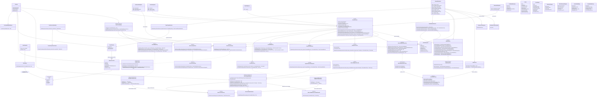

# Class Diagram — ControlIT Runtime/Data Architecture

**Scope:** Current ControlIT API layer after alpha hardening. ControlIT exposes NetLock and NetBird capability; it does not rewrite NetLock.
**Source truth:** Current `src/ControlIT.Api` code and `graphify-out/GRAPH_REPORT.md`.
**Boundary rule:** Dapper reads NetLock-owned tables. EF Core owns only `controlit_*` tables. NetBird is external API state plus ControlIT mapping tables.

---

```mermaid
classDiagram
    %% ─────────────────────────────────────────────
    %% ASP.NET RUNTIME
    %% ─────────────────────────────────────────────

    class Program {
        +UseAuthentication()
        +UseAuthorization()
        +UseRateLimiter()
        +MapEndpoints()
    }

    class ErrorHandlingMiddleware {
        +InvokeAsync(HttpContext) Task
    }

    class HttpActorContext {
        +UserId int
        +Role Role
        +TenantId int?
        +AssignedClients IReadOnlyList~int~
        +Email string
        +IpAddress string?
    }

    class TenantContext {
        +TenantId int?
        +IsAllTenants bool
        +IsResolved bool
    }

    class TenantTargetResolver {
        +ResolveAsync(TenantContext, targetTenantId int?, ITenantRepository) Task~TenantResolutionResult~
    }

    class RoleCeiling {
        +CanManage(actorRole Role, targetRole Role) bool
    }

    class Role {
        <<enumeration>>
        SuperAdmin
        CpAdmin
        ClientAdmin
        Technician
    }

    %% ─────────────────────────────────────────────
    %% ENDPOINTS
    %% ─────────────────────────────────────────────

    class DeviceEndpoints {
        +GET_devices()
        +GET_device_by_id()
        +GET_device_metrics()
    }

    class EventEndpoints {
        +GET_events()
    }

    class CommandEndpoints {
        +POST_commands_execute()
        +POST_commands_batch()
    }

    class DashboardEndpoints {
        +GET_dashboard()
        +GET_dashboard_stream()
        +GET_sync_stream()
    }

    class NetworkEndpoints {
        +GET_network_peers()
        +POST_network_tenant_group()
        +GET_network_setup_keys()
        +POST_network_setup_keys()
        +DELETE_network_setup_key()
        +POST_network_enrol()
        +POST_network_peer_link()
        +DELETE_network_peer_link()
        +PUT_network_peer()
        +GET_network_summary()
    }

    class UserEndpoints {
        +enforce_role_ceiling()
        +manage_users()
    }

    %% ─────────────────────────────────────────────
    %% APPLICATION SERVICES
    %% ─────────────────────────────────────────────

    class ControlItFacade {
        <<Facade>>
        -_devices IDeviceRepository
        -_events IEventRepository
        -_commands ICommandDispatcher
        -_endpoint IEndpointProvider
        -_netLockAdmin INetLockAdminClient
        -_netbirdMappings INetbirdMappingRepository
        -_pushEvents IPushEventPublisher
        +GetDevicesAsync(filter DeviceFilter, tenant TenantContext) Task~PagedResult~
        +GetDeviceByIdAsync(id int, tenant TenantContext) Task~DeviceResponse?~
        +GetDashboardSummaryAsync(tenant TenantContext) Task~DashboardSummary~
        +GetDashboardPushSnapshotAsync(tenant TenantContext) Task~IReadOnlyList~PushEventEnvelope~~
        +ExecuteCommandAsync(request CommandRequest, tenant TenantContext) Task~CommandResult~
        +GetEventsAsync(tenant TenantContext, page int, pageSize int) Task~PagedResult~
    }

    class TenantNetworkService {
        +EnsureTenantGroupAsync(tenantId int) Task~string~
        +BindTenantGroupAsync(tenantId int, groupId string, mode string) Task~TenantNetbirdGroup~
        +GetTenantGroupAsync(tenantId int) Task~TenantNetbirdGroup?~
        +GetTenantPeersAsync(tenantId int) Task~IEnumerable~NetbirdPeer~~
    }

    class PeerDeviceLinkHandler {
        +LinkAsync(peerId string, deviceId int, tenantId int) Task~IResult~
    }

    class TenantScopedDeviceGuard {
        +ExistsInTenantAsync(IDeviceRepository, deviceId int, tenantId int) Task~bool~
    }

    class AuditService {
        +RecordAsync(entry AuditEntry) Task
        +QueryAsync(...) Task~IEnumerable~AuditEntry~~
    }

    %% ─────────────────────────────────────────────
    %% PUSH / SSE
    %% ─────────────────────────────────────────────

    class IPushEventPublisher {
        <<interface>>
        +PublishAsync(evt PushEventEnvelope) ValueTask
        +SubscribeAsync(scope PushSubscriptionScope) IAsyncEnumerable~PushEventEnvelope~
    }

    class PushEventHub {
        <<InMemoryHub>>
        -_subscribers ConcurrentDictionary~Guid Subscriber~
        +PublishAsync(evt PushEventEnvelope) ValueTask
        +SubscribeAsync(scope PushSubscriptionScope) IAsyncEnumerable~PushEventEnvelope~
        +CanReceive(scope PushSubscriptionScope, evt PushEventEnvelope) bool
    }

    class NetLockLiveBridge {
        <<BackgroundService>>
        +TickAsync(ct CancellationToken) Task
        -LoadAllDevicesAsync(ct CancellationToken) Task~IReadOnlyList~Device~~
        -PublishHealthAsync(status string, reason string?, force bool) Task
    }

    class PushEventEnvelope {
        +Version int
        +Type string
        +TenantId int?
        +EmittedAt DateTimeOffset
        +Payload object
    }

    %% ─────────────────────────────────────────────
    %% NETLOCK INTEGRATION
    %% ─────────────────────────────────────────────

    class INetLockAdminClient {
        <<interface>>
        +GetConnectedAccessKeysAsync(ct CancellationToken) Task~IReadOnlySet~string~~
        +GetConnectedDevicesSnapshotAsync(ct CancellationToken) Task~NetLockConnectedDevicesSnapshot~
    }

    class NetLockAdminClient {
        <<HttpClient>>
        +GetConnectedAccessKeysAsync(ct CancellationToken) Task~IReadOnlySet~string~~
        +GetConnectedDevicesSnapshotAsync(ct CancellationToken) Task~NetLockConnectedDevicesSnapshot~
    }

    class ICommandDispatcher {
        <<interface>>
        +DispatchAsync(deviceAccessKey string, request CommandRequest, ct CancellationToken) Task~CommandResult~
    }

    class SignalRCommandDispatcher {
        <<Strategy>>
        +DispatchAsync(deviceAccessKey string, request CommandRequest, ct CancellationToken) Task~CommandResult~
    }

    class IEndpointProvider {
        <<interface>>
        +IsConnected bool
        +ProviderName string
        +DispatchCommandAsync(deviceAccessKey string, commandJson string, timeout TimeSpan, ct CancellationToken) Task~string~
    }

    class NetLockEndpointProvider {
        <<Adapter>>
        +IsConnected bool
        +ProviderName string
        +DispatchCommandAsync(deviceAccessKey string, commandJson string, timeout TimeSpan, ct CancellationToken) Task~string~
    }

    class NetLockSignalRService {
        <<Singleton HostedService>>
        -_pendingCommands ConcurrentDictionary~string PendingCommand~
        +IsConnected bool
        +StartAsync(ct CancellationToken) Task
        +StopAsync(ct CancellationToken) Task
        +InvokeCommandAsync(deviceAccessKey string, commandJson string, timeout TimeSpan) Task~string~
        +BuildAdminIdentityHeaderValue(adminToken string) string
        -LookupDeviceIdAsync(accessKey string) Task~string~
        -ValidateAdminTokenAsync(ct CancellationToken) Task~bool~
    }

    class INetLockAdminSessionTokenProvider {
        <<interface>>
        +GetTokenAsync(ct CancellationToken) Task~string~
    }

    class NetLockSchemaValidator {
        +ValidateRequiredColumnsAsync(ct CancellationToken) Task
    }

    %% ─────────────────────────────────────────────
    %% NETBIRD INTEGRATION
    %% ─────────────────────────────────────────────

    class INetbirdClient {
        <<interface>>
        +GetPeersAsync() Task~IEnumerable~NetbirdPeer~~
        +GetPeerByIdAsync(peerId string) Task~NetbirdPeer?~
        +GetGroupsAsync() Task~IEnumerable~NetbirdGroup~~
        +CreateGroupAsync(name string, peerIds List~string~) Task~NetbirdGroup~
        +GetSetupKeysAsync() Task~IEnumerable~NetbirdSetupKey~~
        +GetSetupKeyByIdAsync(keyId string) Task~NetbirdSetupKey?~
        +CreateSetupKeyAsync(request CreateSetupKeyRequest) Task~NetbirdSetupKey~
        +DeleteSetupKeyAsync(keyId string) Task
        +CreatePolicyAsync(request CreatePolicyRequest) Task~NetbirdPolicy~
        +GetRoutesAsync() Task~IEnumerable~NetbirdRoute~~
        +GetEventsAsync() Task~IEnumerable~NetbirdEvent~~
    }

    class NetbirdApiClient {
        <<HttpClient Adapter>>
        -AuthorizationScheme string
        +GetPeersAsync() Task~IEnumerable~NetbirdPeer~~
        +CreateSetupKeyAsync(request CreateSetupKeyRequest) Task~NetbirdSetupKey~
    }

    class INetbirdMappingRepository {
        <<interface>>
        +GetByDeviceIdAsync(deviceId int) Task~DeviceNetbirdMap?~
        +GetByDeviceIdsAsync(deviceIds IEnumerable~int~) Task~IReadOnlyDictionary~
        +GetByPeerIdAsync(peerId string) Task~DeviceNetbirdMap?~
        +CreateMappingAsync(map DeviceNetbirdMap) Task
        +DeleteByPeerIdAsync(peerId string) Task
        +GetTenantGroupAsync(tenantId int) Task~TenantNetbirdGroup?~
        +UpsertTenantGroupAsync(group TenantNetbirdGroup) Task
    }

    class NetbirdMappingRepository {
        <<EF Repository>>
        +ManageDevicePeerMappings()
        +ManageTenantGroupMappings()
    }

    %% ─────────────────────────────────────────────
    %% DATA ACCESS
    %% ─────────────────────────────────────────────

    class IDeviceRepository {
        <<interface>>
        +GetAllAsync(filter DeviceFilter, tenant TenantContext, ct CancellationToken) Task~tuple~
        +GetByIdAsync(id int, tenant TenantContext, ct CancellationToken) Task~Device?~
        +GetAllAccessKeysAsync(tenant TenantContext, ct CancellationToken) Task~IEnumerable~string~~
        +GetAccessKeyAsync(deviceId int, tenant TenantContext, ct CancellationToken) Task~string?~
    }

    class MySqlDeviceRepository {
        <<Dapper ReadRepository>>
        +GetAllAsync(...) Task~tuple~
        +GetByIdAsync(...) Task~Device?~
        +GetAllAccessKeysAsync(...) Task~IEnumerable~string~~
    }

    class IEventRepository {
        <<interface>>
        +GetAllAsync(tenant TenantContext, limit int, offset int, ct CancellationToken) Task~tuple~
        +GetTotalCountAsync(tenant TenantContext, ct CancellationToken) Task~int~
    }

    class MySqlEventRepository {
        <<Dapper ReadRepository>>
        +GetAllAsync(...) Task~tuple~
        +GetTotalCountAsync(...) Task~int~
    }

    class ITenantRepository {
        <<interface>>
        +GetAllAsync(tenant TenantContext, ct CancellationToken) Task~IEnumerable~Tenant~~
        +GetByIdAsync(id int, ct CancellationToken) Task~Tenant?~
        +GetLocationsByTenantAsync(tenantId int, ct CancellationToken) Task~IEnumerable~Location~~
        +CountAsync(ct CancellationToken) Task~int~
    }

    class ControlItDbContext {
        <<EF Core>>
        +AuditLog DbSet~AuditEntry~
        +Users DbSet~ControlItUser~
        +RefreshTokens DbSet~RefreshToken~
        +PasswordResetTokens DbSet~PasswordResetToken~
        +DeviceNetbirdMaps DbSet~DeviceNetbirdMap~
        +TenantNetbirdGroups DbSet~TenantNetbirdGroup~
    }

    class IDbConnectionFactory {
        <<interface>>
        +CreateConnectionAsync(ct CancellationToken) Task~IDbConnection~
    }

    %% ─────────────────────────────────────────────
    %% MODELS / DTOS
    %% ─────────────────────────────────────────────

    class Device {
        +Id int
        +TenantId int
        +DeviceName string
        +AccessKey string
        +Platform string
        +OperatingSystem string
        +CpuUsage double?
        +RamUsage double?
        +LastAccess DateTime
    }

    class DeviceResponse {
        +Id int
        +TenantId int
        +DeviceName string
        +IsOnline bool
        +NetbirdIp string?
        +NetbirdPeerId string?
        +NetbirdHostname string?
    }

    class DeviceEvent {
        +Id int
        +DeviceId int
        +TenantName string
        +DeviceName string
        +Timestamp DateTime
        +Severity string
        +Event string
        +Description string
    }

    class CommandRequest {
        +DeviceId int
        +Command string
        +Shell string
        +TimeoutSeconds int
    }

    class BatchCommandRequest {
        +MaxDeviceCount$ int
        +DeviceIds List~int~
        +Command string
        +Shell string
        +TimeoutSeconds int
    }

    class SetupKeyListResponse {
        +KeyRedacted string
    }

    class SetupKeyCreateResponse {
        +Key string
    }

    class DeviceNetbirdMap {
        +DeviceId int
        +NetbirdPeerId string
        +NetbirdIp string
        +NetbirdHostname string
        +MappedBy string
    }

    class TenantNetbirdGroup {
        +TenantId int
        +NetbirdGroupId string
        +IsolationPolicyId string
        +GroupMode string
        +ControlItManaged bool
    }

    %% ─────────────────────────────────────────────
    %% IMPLEMENTATION RELATIONSHIPS
    %% ─────────────────────────────────────────────

    IDeviceRepository <|.. MySqlDeviceRepository
    IEventRepository <|.. MySqlEventRepository
    ICommandDispatcher <|.. SignalRCommandDispatcher
    IEndpointProvider <|.. NetLockEndpointProvider
    INetLockAdminClient <|.. NetLockAdminClient
    INetbirdClient <|.. NetbirdApiClient
    INetbirdMappingRepository <|.. NetbirdMappingRepository
    IPushEventPublisher <|.. PushEventHub

    Program --> ErrorHandlingMiddleware
    Program --> TenantContext
    Program --> PushEventHub
    Program --> NetLockSignalRService
    Program --> NetLockLiveBridge

    HttpActorContext --> Role
    TenantContext --> HttpActorContext : derives scope from JWT claims
    TenantTargetResolver --> TenantContext : targetTenantId rules
    RoleCeiling --> Role : strict lower-role management only

    DeviceEndpoints --> ControlItFacade
    EventEndpoints --> ControlItFacade
    CommandEndpoints --> ControlItFacade
    DashboardEndpoints --> ControlItFacade
    DashboardEndpoints --> IPushEventPublisher : SSE subscribe
    NetworkEndpoints --> TenantTargetResolver
    NetworkEndpoints --> TenantNetworkService
    NetworkEndpoints --> INetbirdClient
    NetworkEndpoints --> INetbirdMappingRepository
    NetworkEndpoints --> AuditService
    UserEndpoints --> RoleCeiling

    ControlItFacade --> IDeviceRepository
    ControlItFacade --> IEventRepository
    ControlItFacade --> ITenantRepository
    ControlItFacade --> ICommandDispatcher
    ControlItFacade --> IEndpointProvider
    ControlItFacade --> INetLockAdminClient
    ControlItFacade --> INetbirdMappingRepository
    ControlItFacade --> IPushEventPublisher

    SignalRCommandDispatcher --> NetLockSignalRService
    NetLockEndpointProvider --> NetLockSignalRService
    NetLockSignalRService --> IDbConnectionFactory : device_id lookup only
    NetLockSignalRService --> NetLockSchemaValidator
    NetLockSignalRService --> INetLockAdminSessionTokenProvider : admin token never logged
    NetLockLiveBridge --> INetLockAdminClient
    NetLockLiveBridge --> IDeviceRepository
    NetLockLiveBridge --> IPushEventPublisher

    TenantNetworkService --> INetbirdClient
    TenantNetworkService --> INetbirdMappingRepository
    PeerDeviceLinkHandler --> TenantScopedDeviceGuard
    PeerDeviceLinkHandler --> INetbirdMappingRepository

    MySqlDeviceRepository --> IDbConnectionFactory : NetLock tables read-only
    MySqlEventRepository --> IDbConnectionFactory : NetLock tables read-only
    NetbirdMappingRepository --> ControlItDbContext : controlit_* only
    AuditService --> ControlItDbContext : controlit_audit_log

    ControlItFacade --> DeviceResponse : omits AccessKey
    NetworkEndpoints --> SetupKeyListResponse : raw key redacted
    NetworkEndpoints --> SetupKeyCreateResponse : raw key once
```

---

## Accuracy Notes

| Concern | Current behavior |
|---|---|
| ControlIT boundary | API layer/facade over NetLock and NetBird. NetLock endpoint logic remains outside ControlIT. |
| NetLock data | `devices`, `events`, `tenants`, `locations`, and token checks use Dapper/raw SQL only. No EF migration touches them. |
| ControlIT data | EF Core owns `controlit_audit_log`, `controlit_users`, `controlit_refresh_tokens`, `controlit_password_reset_tokens`, `controlit_device_netbird_map`, `controlit_tenant_netbird_group`. |
| Tenant scope | `TenantContext` derives from JWT `IActorContext`. `ApiKeyMiddleware` is retained only as rollback reference and is not registered. |
| Elevated network scope | `SuperAdmin`/`CpAdmin` must supply `targetTenantId`; scoped users cannot override their tenant. |
| Role ceiling | Actor can manage only strictly lower roles; `SuperAdmin` cannot manage another `SuperAdmin`. |
| Secrets | Device `AccessKey` stays backend-only. NetLock admin token never logged. Setup-key list responses always use `[redacted]`; create response returns raw key once. |
| Commands | HTTP request uses `DeviceId`; facade looks up tenant-scoped `Device`, then dispatches with backend-only `AccessKey`. Pending command key is NetLock `device_id`. |
| Push path | `NetLockLiveBridge` publishes live device/health events to `PushEventHub`; dashboard streams snapshot then live events over SSE. |
