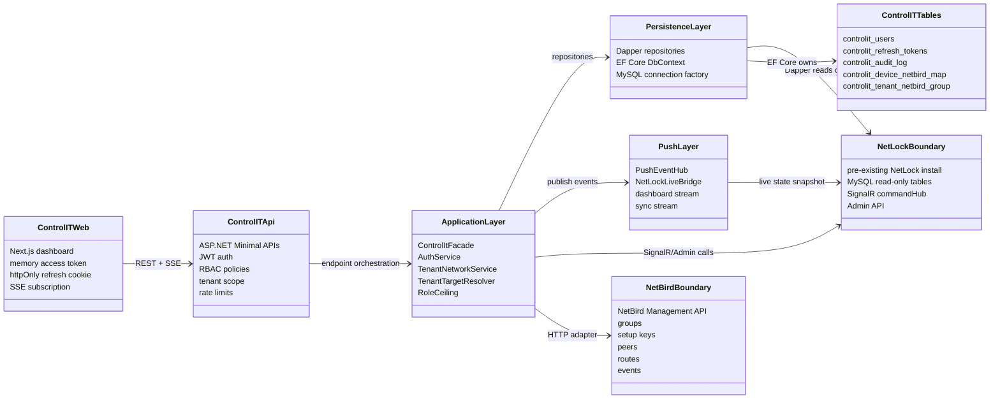

# CLASS 01 - Overall Architecture

## Notes

- ControlIT is API/dashboard layer, not NetLock fork.
- NetLock tables stay vendor-owned and read-only to ControlIT.
- NetBird state lives in NetBird; ControlIT stores tenant/device mappings only.
- Dashboard live state comes from SSE push. No polling fallback.
