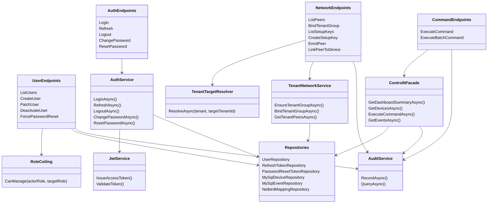

# CLASS 02 - API Services and Security

## Security Invariants

| Area | Rule |
|---|---|
| Role ceiling | No actor manages equal-or-higher role. |
| Tenant scope | Tenant members stay inside own `tenant_id`. |
| Elevated network ops | SuperAdmin/CpAdmin provide `targetTenantId`. |
| Setup keys | Raw key returned once on create; list returns `[redacted]`. |
| Secrets | NetLock access keys and admin tokens stay backend-side. |
| Rate limits | Partitioned by authenticated actor, anonymous IP fallback. |
