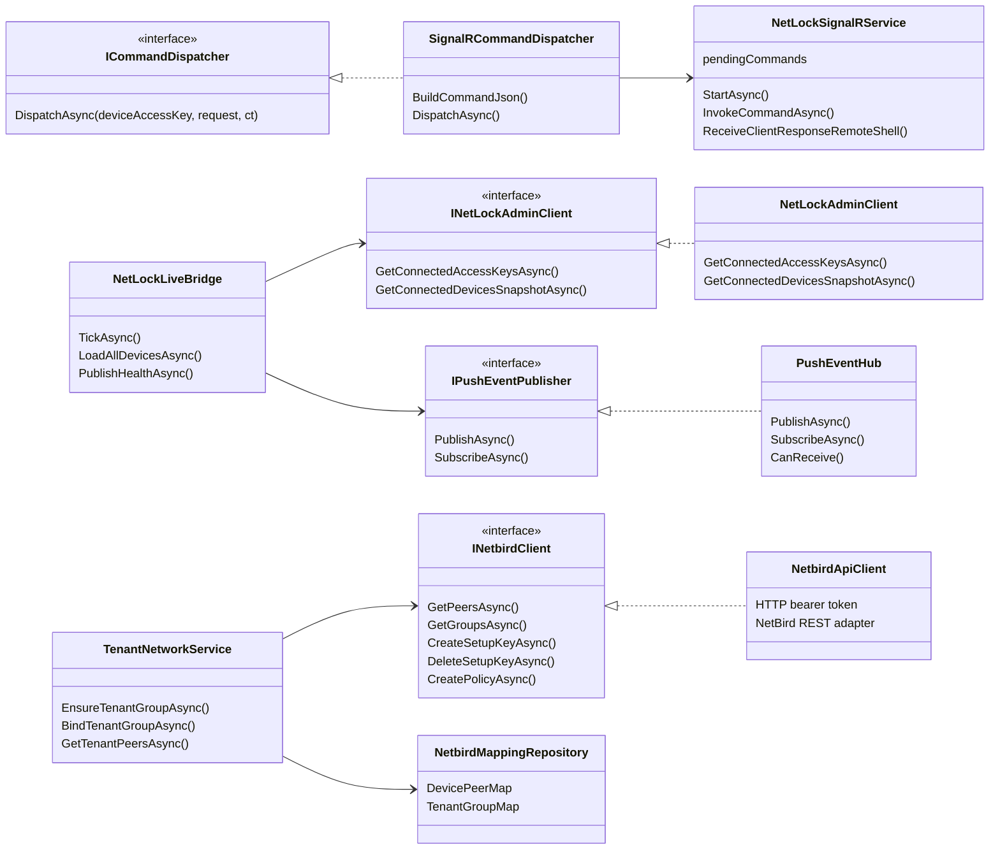

# CLASS 03 - NetLock, NetBird, Push Integrations

## Boundary Notes

- NetLock SignalR command payload uses backend-only device access key.
- `NetLockLiveBridge` translates NetLock live state into ControlIT push events.
- `PushEventHub` filters by tenant server-side before writing SSE frames.
- `TenantNetworkService` keeps NetBird group ownership separate from device inventory.
