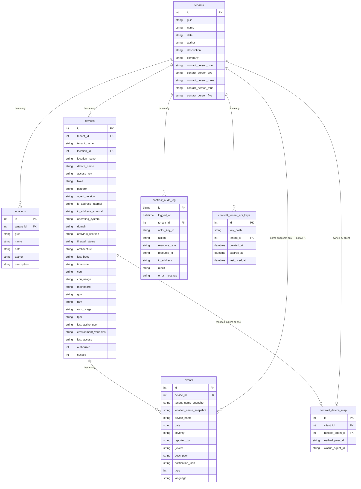

# ER Diagram 01 — NetLock RMM + ControlIT Owned Tables

**Scope:** NetLock RMM tables read by ControlIT (read-only via Dapper) and ControlIT's own tables (owned via EF Core).
**Phase:** Phase 1 — Computer Port internal operations dashboard.
**Field names:** Verified against actual NetLock MySQL INSERT/UPDATE queries in `Authentification.cs`, `Event_Handler.cs`, and `Add_Tenant_Dialog.razor` / `Add_Location_Dialog.razor`.

---

