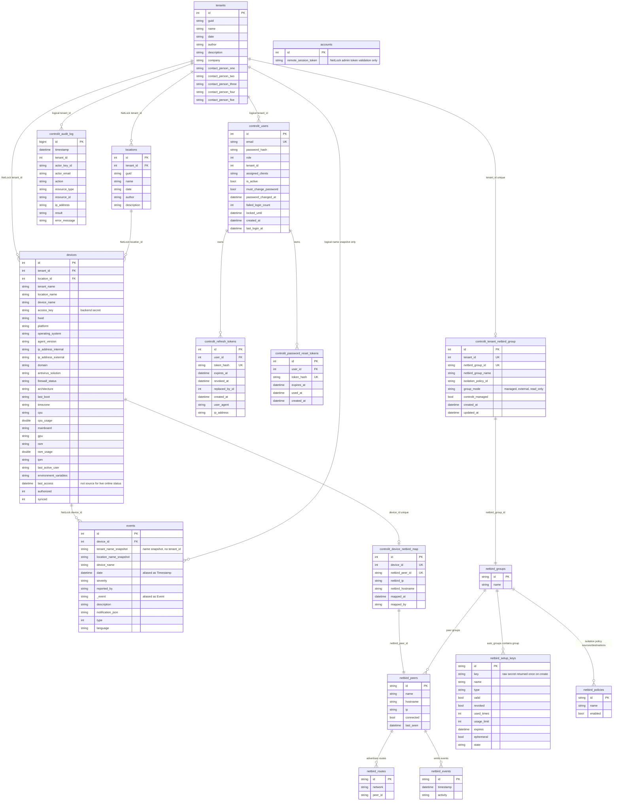

# ER Diagram 01 — NetLock + ControlIT + NetBird Data Boundary

**Scope:** Runtime data architecture after alpha hardening.
**NetLock boundary:** ControlIT reads NetLock-owned tables with Dapper. No ControlIT migrations or writes against non-`controlit_*` tables.
**ControlIT boundary:** EF Core owns only `controlit_*` tables. NetBird resources live in NetBird API; ControlIT stores only mappings.

---

```mermaid
erDiagram
    %% ─────────────────────────────────────────────────────────────────
    %% NETLOCK-OWNED MYSQL TABLES — READ-ONLY FROM CONTROLIT
    %% ─────────────────────────────────────────────────────────────────

    tenants {
        int     id                  PK
        string  guid
        string  name
        string  date
        string  author
        string  description
        string  company
        string  contact_person_one
        string  contact_person_two
        string  contact_person_three
        string  contact_person_four
        string  contact_person_five
    }

    locations {
        int     id          PK
        int     tenant_id   FK
        string  guid
        string  name
        string  date
        string  author
        string  description
    }

    devices {
        int      id                   PK
        int      tenant_id            FK
        int      location_id          FK
        string   tenant_name
        string   location_name
        string   device_name
        string   access_key           "backend secret"
        string   hwid
        string   platform
        string   operating_system
        string   agent_version
        string   ip_address_internal
        string   ip_address_external
        string   domain
        string   antivirus_solution
        string   firewall_status
        string   architecture
        string   last_boot
        string   timezone
        string   cpu
        double   cpu_usage
        string   mainboard
        string   gpu
        string   ram
        double   ram_usage
        string   tpm
        string   last_active_user
        string   environment_variables
        datetime last_access          "not source for live online status"
        int      authorized
        int      synced
    }

    events {
        int      id                      PK
        int      device_id               FK
        string   tenant_name_snapshot    "name snapshot, no tenant_id"
        string   location_name_snapshot
        string   device_name
        datetime date                    "aliased as Timestamp"
        string   severity
        string   reported_by
        string   _event                  "aliased as Event"
        string   description
        string   notification_json
        int      type
        string   language
    }

    accounts {
        int     id                    PK
        string  remote_session_token  "NetLock admin token validation only"
    }

    %% ─────────────────────────────────────────────────────────────────
    %% CONTROLIT-OWNED TABLES — EF CORE, controlit_* ONLY
    %% ─────────────────────────────────────────────────────────────────

    controlit_audit_log {
        bigint   id              PK
        datetime timestamp
        int      tenant_id
        string   actor_key_id
        string   actor_email
        string   action
        string   resource_type
        string   resource_id
        string   ip_address
        string   result
        string   error_message
    }

    controlit_users {
        int      id                  PK
        string   email               UK
        string   password_hash
        int      role
        int      tenant_id
        string   assigned_clients
        bool     is_active
        bool     must_change_password
        datetime password_changed_at
        int      failed_login_count
        datetime locked_until
        datetime created_at
        datetime last_login_at
    }

    controlit_refresh_tokens {
        int      id              PK
        int      user_id         FK
        string   token_hash      UK
        datetime expires_at
        datetime revoked_at
        int      replaced_by_id
        datetime created_at
        string   user_agent
        string   ip_address
    }

    controlit_password_reset_tokens {
        int      id              PK
        int      user_id         FK
        string   token_hash      UK
        datetime expires_at
        datetime used_at
        datetime created_at
    }

    controlit_device_netbird_map {
        int      id                  PK
        int      device_id           UK
        string   netbird_peer_id     UK
        string   netbird_ip
        string   netbird_hostname
        datetime mapped_at
        string   mapped_by
    }

    controlit_tenant_netbird_group {
        int      id                    PK
        int      tenant_id             UK
        string   netbird_group_id      UK
        string   netbird_group_name
        string   isolation_policy_id
        string   group_mode            "managed, external, read_only"
        bool     controlit_managed
        datetime created_at
        datetime updated_at
    }

    %% ─────────────────────────────────────────────────────────────────
    %% EXTERNAL NETBIRD API RESOURCES — NOT CONTROLIT TABLES
    %% ─────────────────────────────────────────────────────────────────

    netbird_groups {
        string id       PK
        string name
    }

    netbird_peers {
        string   id          PK
        string   name
        string   hostname
        string   ip
        bool     connected
        datetime last_seen
    }

    netbird_setup_keys {
        string   id          PK
        string   key         "raw secret returned once on create"
        string   name
        string   type
        bool     valid
        bool     revoked
        int      used_times
        int      usage_limit
        datetime expires
        bool     ephemeral
        string   state
    }

    netbird_policies {
        string id       PK
        string name
        bool   enabled
    }

    netbird_routes {
        string id       PK
        string network
        string peer_id
    }

    netbird_events {
        string   id          PK
        datetime timestamp
        string   activity
    }

    %% ─────────────────────────────────────────────────────────────────
    %% RELATIONSHIPS
    %% ─────────────────────────────────────────────────────────────────

    tenants ||--o{ locations : "NetLock tenant_id"
    tenants ||--o{ devices : "NetLock tenant_id"
    locations ||--o{ devices : "NetLock location_id"
    devices ||--o{ events : "NetLock device_id"
    tenants ||--o{ events : "logical name snapshot only"

    controlit_users ||--o{ controlit_refresh_tokens : "owns"
    controlit_users ||--o{ controlit_password_reset_tokens : "owns"
    tenants ||--o{ controlit_users : "logical tenant_id"
    tenants ||--o{ controlit_audit_log : "logical tenant_id"

    devices ||--o| controlit_device_netbird_map : "device_id unique"
    tenants ||--o| controlit_tenant_netbird_group : "tenant_id unique"

    controlit_tenant_netbird_group ||--|| netbird_groups : "netbird_group_id"
    controlit_device_netbird_map ||--|| netbird_peers : "netbird_peer_id"
    netbird_groups ||--o{ netbird_peers : "peer groups"
    netbird_groups ||--o{ netbird_setup_keys : "auto_groups contains group"
    netbird_groups ||--o{ netbird_policies : "isolation policy sources/destinations"
    netbird_peers ||--o{ netbird_routes : "advertises routes"
    netbird_peers ||--o{ netbird_events : "emits events"
```

---

## Boundary Notes

| Concern | Current truth |
|---|---|
| NetLock tables | `tenants`, `locations`, `devices`, `events`, and `accounts` are NetLock-owned. ControlIT reads them with Dapper or validates token presence only. |
| ControlIT tables | Current EF model owns `controlit_audit_log`, `controlit_users`, `controlit_refresh_tokens`, `controlit_password_reset_tokens`, `controlit_device_netbird_map`, `controlit_tenant_netbird_group`. |
| Removed/stale API-key table | `controlit_tenant_api_keys` is not in current EF model; API-key middleware is not registered. JWT claims now drive actor and tenant scope. |
| Device pagination | `/devices` uses one SQL batch: page query plus matching `COUNT(*)`; page size clamped 1-100. |
| Event pagination | `/events` uses one SQL batch: page query plus matching `COUNT(*)`; tenant filter joins `events.tenant_name_snapshot` to `tenants.name`. |
| Online status | Dashboard/device DTO online state comes from NetLock live connected access-key set, not `last_access`. |
| Secrets | `devices.access_key`, NetLock admin token, refresh/reset tokens, and NetBird setup keys are secrets. Setup-key list redacts raw key; create returns raw key once. |
