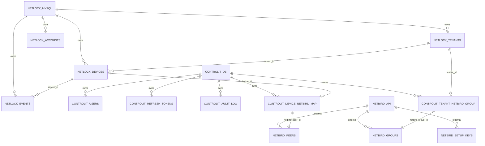

# ER 01 - Overall Data Boundary

## Ownership

| Boundary | ControlIT behavior |
|---|---|
| NetLock MySQL | Dapper read-only. No migrations. No writes. |
| ControlIT tables | EF Core creates/migrates only `controlit_*`. |
| NetBird API | HTTP adapter. ControlIT stores references and mapping only. |
