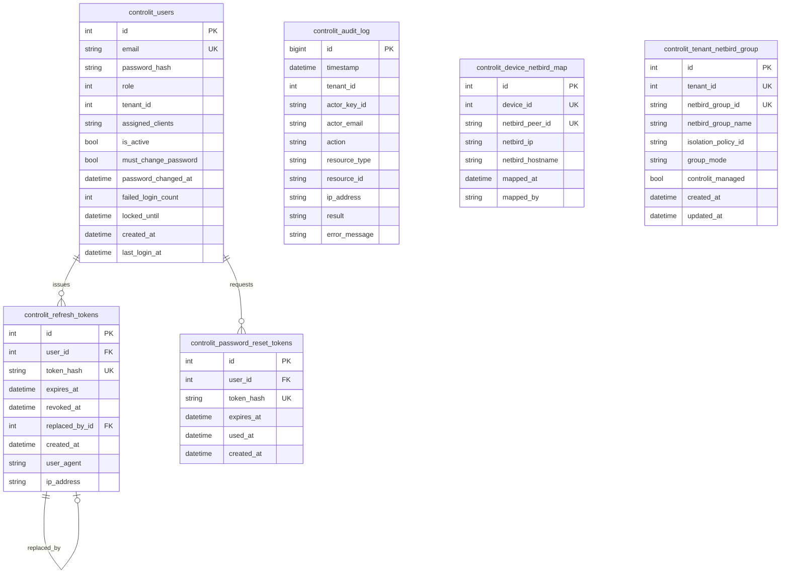

# ER 02 - ControlIT Owned Tables

## Important Fields

| Table | Notes |
|---|---|
| `controlit_users` | Bootstrap creates initial SuperAdmin from env when no user exists. |
| `controlit_refresh_tokens` | Raw token never stored; replay revokes user token chain. |
| `controlit_audit_log` | Actor email, action, result, tenant id retained for admin review. |
| `controlit_device_netbird_map` | Joins NetLock device id to NetBird peer id/IP. |
| `controlit_tenant_netbird_group` | Supports `managed`, `external`, `read_only` group modes. |
