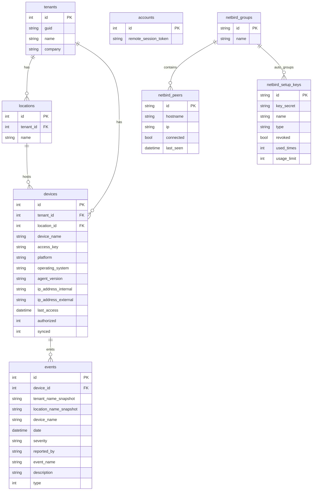

# ER 03 - External Read/API Boundary

## Boundary Rules

- `devices.access_key` and `accounts.remote_session_token` are backend secrets.
- Online state comes from NetLock live connection snapshot, not `last_access`.
- `events.tenant_name_snapshot` is a name snapshot, not tenant FK.
- NetBird setup key secret is revealed once by create response, then redacted in list responses.
