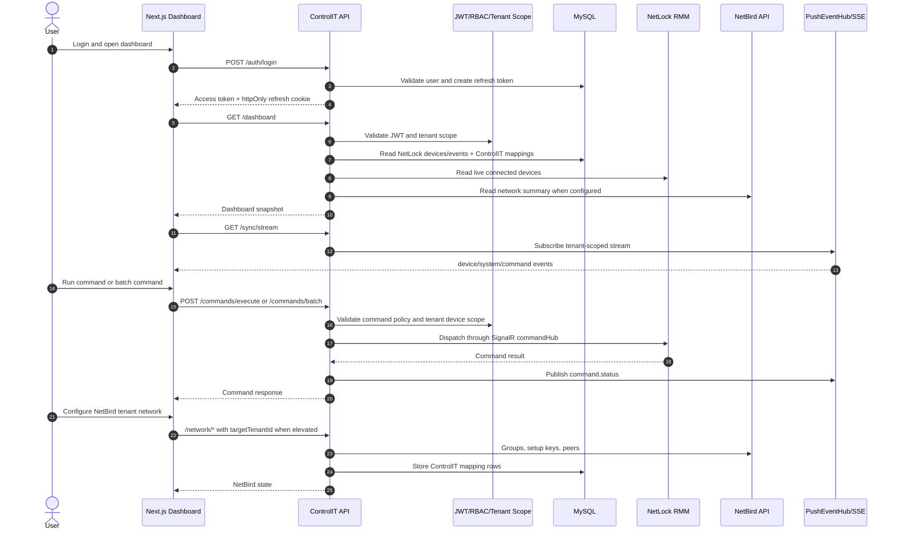

# SEQ0 - MVP Runtime Flow

```mermaid
sequenceDiagram
    autonumber
    actor User
    participant Web as Next.js Dashboard
    participant API as ControlIT API
    participant Auth as JWT/RBAC/Tenant Scope
    participant DB as MySQL
    participant NetLock as NetLock RMM
    participant NetBird as NetBird API
    participant SSE as PushEventHub/SSE

    User->>Web: Login and open dashboard
    Web->>API: POST /auth/login
    API->>DB: Validate user and create refresh token
    API-->>Web: Access token + httpOnly refresh cookie

    Web->>API: GET /dashboard
    API->>Auth: Validate JWT and tenant scope
    API->>DB: Read NetLock devices/events + ControlIT mappings
    API->>NetLock: Read live connected devices
    API->>NetBird: Read network summary when configured
    API-->>Web: Dashboard snapshot

    Web->>API: GET /sync/stream
    API->>SSE: Subscribe tenant-scoped stream
    SSE-->>Web: device/system/command events

    User->>Web: Run command or batch command
    Web->>API: POST /commands/execute or /commands/batch
    API->>Auth: Validate command policy and tenant device scope
    API->>NetLock: Dispatch through SignalR commandHub
    NetLock-->>API: Command result
    API->>SSE: Publish command.status
    API-->>Web: Command response

    User->>Web: Configure NetBird tenant network
    Web->>API: /network/* with targetTenantId when elevated
    API->>NetBird: Groups, setup keys, peers
    API->>DB: Store ControlIT mapping rows
    API-->>Web: NetBird state
```
