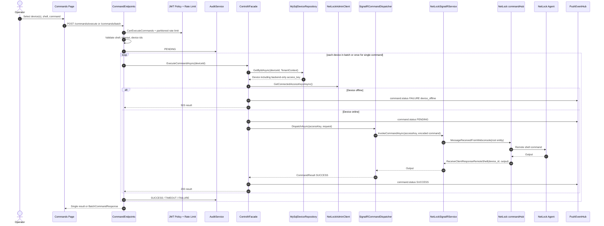

# SEQ1 - Command Execution

## Guarantees

- Client sends `deviceId`, never NetLock access key.
- Backend resolves device inside tenant scope before reading access key.
- Pending command guard prevents concurrent command overwrite per device.
- Batch command returns per-device result; each item gets audit and push status.
