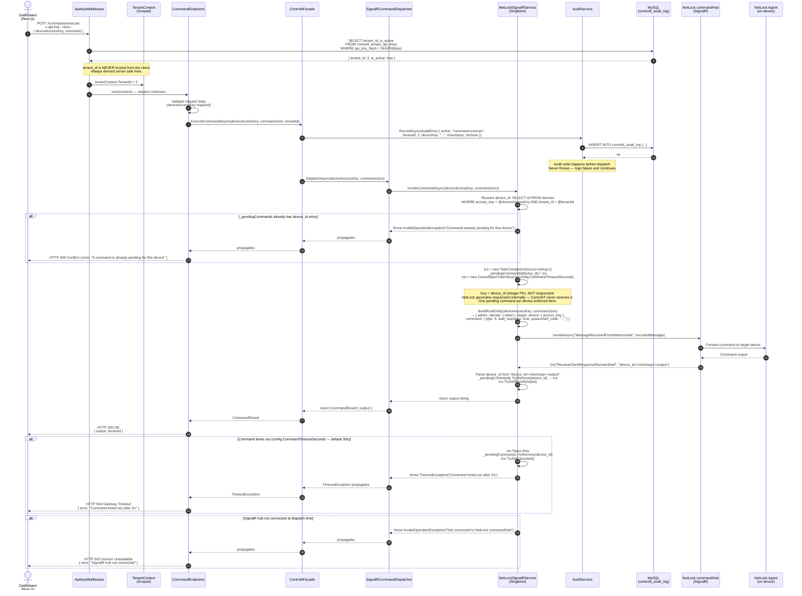

# SEQ1 — POST /commands/execute: Full Command Dispatch Flow

**Scope:** End-to-end flow for dispatching a remote command to a managed endpoint via `POST /commands/execute`.
Covers API key validation, tenant resolution, SignalR dispatch, response correlation by `responseId`, audit logging, and timeout handling.
**Phase:** Phase 1 — NetLock RMM integration.
**Source:** architect_api_layer.md (post-evaluation), source-of-truth.md.

---

---

## Design Decisions

| Concern | Decision |
|---|---|
| API key validation | SHA-256 hash compared against `controlit_tenant_api_keys`. Result cached for 5 minutes per key. |
| Tenant isolation | `TenantContext.TenantId` derived exclusively from API key lookup in `ApiKeyMiddleware`. Never accepted from request body or query params. |
| Audit timing | Intent logged before dispatch. Outcome logged after. `RecordAsync` never throws — audit failure does not block command execution. |
| `_pendingCommands` keying | Keyed by `device_id` (integer PK). NetLock's callback delivers `"device_id>>nlocksep<<output"` — `responseId` is generated internally by NetLock and never returned to ControlIT. One command per device enforced — 409 Conflict if device already has a command in flight. |
| Command timeout | Server-side only — `NetLock:CommandTimeoutSeconds: 30` in `appsettings.json`. Not accepted from the request body. NetLock's internal cleanup runs at 5 minutes (`MAX_COMMAND_AGE_MINUTES`). |
| Rate limiting | `POST /commands/execute` — fixed window: 20 req/min, queue 0. Exceeded: HTTP 429. |
| SignalR reconnect | `InfiniteRetryPolicy` with exponential backoff capped at 60–90s. In-flight commands at disconnect time expire via their CTS. |
