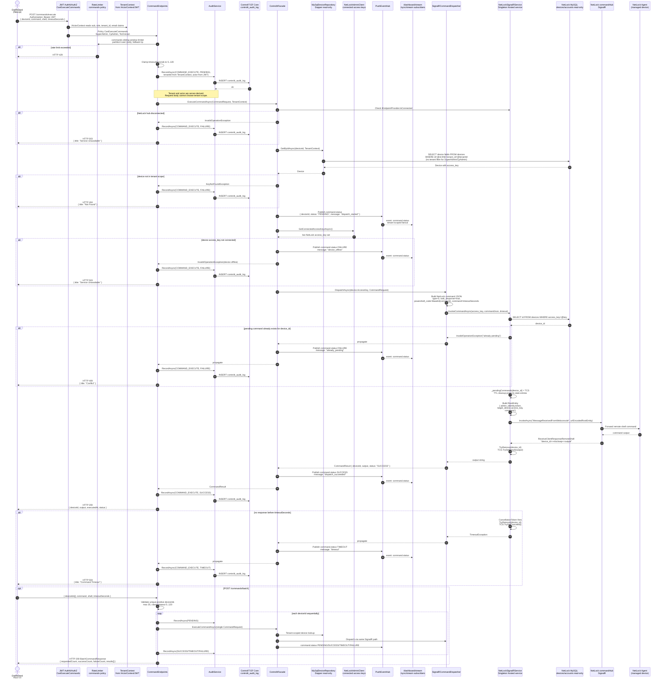

# SEQ1 — POST /commands/execute and /commands/batch

**Scope:** Current command dispatch path through ControlIT API layer to NetLock `commandHub`, plus dashboard push/SSE side effects.
**Current auth:** JWT bearer auth. `ApiKeyMiddleware` is retained in source as rollback reference but is not registered.
**Current request shape:** Clients send `deviceId`; backend resolves tenant-scoped `Device` and uses backend-only `access_key`.

---

```mermaid
sequenceDiagram
    autonumber

    actor Dashboard as Dashboard<br/>(Next.js)
    participant Auth as JWT AuthN/AuthZ<br/>CanExecuteCommands
    participant Rate as RateLimiter<br/>commands policy
    participant TC as TenantContext<br/>from IActorContext/JWT
    participant CE as CommandEndpoints
    participant Audit as AuditService
    participant EF as ControlIT EF Core<br/>controlit_audit_log
    participant Facade as ControlItFacade
    participant DevRepo as MySqlDeviceRepository<br/>Dapper read-only
    participant NetLockAdmin as NetLockAdminClient<br/>connected access keys
    participant Push as PushEventHub
    participant SSE as /dashboard/stream<br/>/sync/stream subscribers
    participant Disp as SignalRCommandDispatcher
    participant SRSvc as NetLockSignalRService<br/>Singleton hosted service
    participant NLDB as NetLock MySQL<br/>devices/accounts read-only
    participant Hub as NetLock commandHub<br/>SignalR
    participant Agent as NetLock Agent<br/>(managed device)

    %% ─────────────────────────────────────────
    %% 1. Request enters authenticated pipeline
    %% ─────────────────────────────────────────

    Dashboard->>Auth: POST /commands/execute<br/>Authorization: Bearer JWT<br/>{ deviceId, command, shell, timeoutSeconds }
    Auth->>TC: IActorContext reads sub, role, tenant_id, email claims
    Auth->>CE: Policy CanExecuteCommands<br/>SuperAdmin, CpAdmin, Technician
    CE->>Rate: commands sliding-window limiter<br/>partition=user:{sub}, fallback=ip

    alt rate limit exceeded
        Rate-->>Dashboard: HTTP 429
    end

    CE->>CE: Clamp timeoutSeconds to 5..120

    %% ─────────────────────────────────────────
    %% 2. Audit pending before dispatch
    %% ─────────────────────────────────────────

    CE->>Audit: RecordAsync(COMMAND_EXECUTE, PENDING,<br/>tenantId from TenantContext, actor from JWT)
    Audit->>EF: INSERT controlit_audit_log
    EF-->>Audit: ok

    Note over CE,Audit: Tenant and actor are server-derived.<br/>Request body cannot choose tenant scope.

    %% ─────────────────────────────────────────
    %% 3. Facade resolves device and online state
    %% ─────────────────────────────────────────

    CE->>Facade: ExecuteCommandAsync(CommandRequest, TenantContext)
    Facade->>SRSvc: Check IEndpointProvider.IsConnected

    alt NetLock hub disconnected
        Facade-->>CE: InvalidOperationException
        CE->>Audit: RecordAsync(COMMAND_EXECUTE, FAILURE)
        Audit->>EF: INSERT controlit_audit_log
        CE-->>Dashboard: HTTP 503<br/>{ title: "Service Unavailable" }
    end

    Facade->>DevRepo: GetByIdAsync(deviceId, TenantContext)
    DevRepo->>NLDB: SELECT device fields FROM devices<br/>WHERE id=@id AND tenant_id=@tenantId<br/>(no tenant filter for SuperAdmin/CpAdmin)
    NLDB-->>DevRepo: Device with access_key
    DevRepo-->>Facade: Device

    alt device not in tenant scope
        Facade-->>CE: KeyNotFoundException
        CE->>Audit: RecordAsync(COMMAND_EXECUTE, FAILURE)
        Audit->>EF: INSERT controlit_audit_log
        CE-->>Dashboard: HTTP 404<br/>{ title: "Not Found" }
    end

    Facade->>Push: Publish command.status<br/>{ deviceId, status: "PENDING", message: "dispatch_started" }
    Push-->>SSE: event: command.status<br/>tenant-scoped fanout

    Facade->>NetLockAdmin: GetConnectedAccessKeysAsync()
    NetLockAdmin-->>Facade: live NetLock access_key set

    alt device access_key not connected
        Facade->>Push: Publish command.status FAILURE<br/>message: "device_offline"
        Push-->>SSE: event: command.status
        Facade-->>CE: InvalidOperationException(device offline)
        CE->>Audit: RecordAsync(COMMAND_EXECUTE, FAILURE)
        Audit->>EF: INSERT controlit_audit_log
        CE-->>Dashboard: HTTP 503<br/>{ title: "Service Unavailable" }
    end

    %% ─────────────────────────────────────────
    %% 4. Dispatch through NetLock SignalR
    %% ─────────────────────────────────────────

    Facade->>Disp: DispatchAsync(device.AccessKey, CommandRequest)
    Disp->>Disp: Build NetLock command JSON<br/>type=0, wait_response=true,<br/>powershell_code=Base64(command), command=timeoutSeconds
    Disp->>SRSvc: InvokeCommandAsync(access_key, commandJson, timeout)

    SRSvc->>NLDB: SELECT id FROM devices WHERE access_key=@key
    NLDB-->>SRSvc: device_id

    alt pending command already exists for device_id
        SRSvc-->>Disp: InvalidOperationException("already pending")
        Disp-->>Facade: propagate
        Facade->>Push: Publish command.status FAILURE<br/>message: "already_pending"
        Push-->>SSE: event: command.status
        Facade-->>CE: propagate
        CE->>Audit: RecordAsync(COMMAND_EXECUTE, FAILURE)
        Audit->>EF: INSERT controlit_audit_log
        CE-->>Dashboard: HTTP 409<br/>{ title: "Conflict" }
    end

    SRSvc->>SRSvc: _pendingCommands[device_id] = TCS<br/>TTL cleanup protects stale entries
    SRSvc->>SRSvc: Build RootEntity<br/>{ admin_identity.token,<br/>target_device.access_key,<br/>command }
    SRSvc->>Hub: InvokeAsync("MessageReceivedFromWebconsole", urlEncodedRootEntity)
    Hub->>Agent: Forward remote shell command

    %% ─────────────────────────────────────────
    %% 5a. Success
    %% ─────────────────────────────────────────

    Agent-->>Hub: command output
    Hub-->>SRSvc: ReceiveClientResponseRemoteShell<br/>"device_id>>nlocksep<<output"
    SRSvc->>SRSvc: TryRemove(device_id)<br/>TCS.TrySetResult(output)
    SRSvc-->>Disp: output string
    Disp-->>Facade: CommandResult { deviceId, output, status: "SUCCESS" }
    Facade->>Push: Publish command.status SUCCESS<br/>message: "dispatch_succeeded"
    Push-->>SSE: event: command.status
    Facade-->>CE: CommandResult
    CE->>Audit: RecordAsync(COMMAND_EXECUTE, SUCCESS)
    Audit->>EF: INSERT controlit_audit_log
    CE-->>Dashboard: HTTP 200<br/>{ deviceId, output, executedAt, status }

    %% ─────────────────────────────────────────
    %% 5b. Timeout
    %% ─────────────────────────────────────────

    alt no response before timeoutSeconds
        SRSvc->>SRSvc: CancellationToken fires<br/>TryRemove(device_id)<br/>TCS.TrySetCanceled()
        SRSvc-->>Disp: TimeoutException
        Disp-->>Facade: propagate
        Facade->>Push: Publish command.status TIMEOUT<br/>message: "timeout"
        Push-->>SSE: event: command.status
        Facade-->>CE: propagate
        CE->>Audit: RecordAsync(COMMAND_EXECUTE, TIMEOUT)
        Audit->>EF: INSERT controlit_audit_log
        CE-->>Dashboard: HTTP 504<br/>{ title: "Command Timeout" }
    end

    %% ─────────────────────────────────────────
    %% 6. Batch path
    %% ─────────────────────────────────────────

    opt POST /commands/batch
        Dashboard->>CE: { deviceIds[], command, shell, timeoutSeconds }
        CE->>CE: Validate unique positive deviceIds<br/>max 25, clamp timeout 5..120
        loop each deviceId sequentially
            CE->>Audit: RecordAsync(PENDING)
            CE->>Facade: ExecuteCommandAsync(single CommandRequest)
            Facade->>DevRepo: Tenant-scoped device lookup
            Facade->>Disp: Dispatch via same SignalR path
            Facade->>Push: command.status PENDING/SUCCESS/TIMEOUT/FAILURE
            CE->>Audit: RecordAsync(SUCCESS/TIMEOUT/FAILURE)
        end
        CE-->>Dashboard: HTTP 200 BatchCommandResponse<br/>{ requestedCount, successCount, failureCount, results[] }
    end
```

---

## Design Decisions

| Concern | Current decision |
|---|---|
| Auth and tenant scope | JWT bearer auth populates `IActorContext`; `TenantContext` derives `TenantId`/`IsAllTenants` from JWT role and claims. |
| API keys | `ApiKeyMiddleware` is not registered. Old API-key tenant derivation is not current runtime path. |
| Request identifier | Client sends `deviceId`, not `deviceAccessKey`. Backend reads `access_key` only after tenant-scoped `Device` lookup. |
| Access-key exposure | Device DTOs, push events, command responses, and audit records do not expose raw NetLock access keys. |
| Dispatch status push | `ControlItFacade` publishes `command.status` events on pending, success, timeout, offline, already-pending, and unavailable paths. SSE filters by tenant unless subscriber has all-tenant scope. |
| Pending command key | `NetLockSignalRService` keys `_pendingCommands` by NetLock `device_id` string because callback format is `"device_id>>nlocksep<<output"`. |
| Batch commands | `/commands/batch` validates max 25 unique device IDs, then executes each item through the same single-command facade path and returns per-device results. |
| Rate limiting | Commands use authenticated actor/IP partitioned sliding-window limiter, default 20 req/min, no queue. |
| Audit trail | Endpoint writes `PENDING` before dispatch and terminal `SUCCESS`/`TIMEOUT`/`FAILURE` after each command item. |
| Secrets | NetLock admin token and device access keys stay backend-side and are never logged or returned. |
