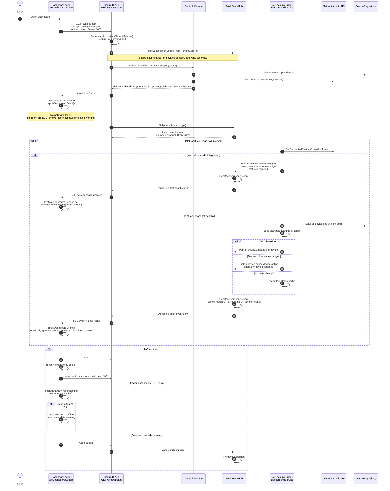

# SEQ2 - Dashboard Push Stream

```mermaid
sequenceDiagram
    autonumber
    actor User
    participant Web as Dashboard page<br/>useDashboardStream
    participant Api as ControlIT API<br/>GET /sync/stream
    participant Facade as ControlItFacade
    participant Hub as PushEventHub
    participant Bridge as NetLockLiveBridge<br/>BackgroundService
    participant NetLock as NetLock Admin API
    participant Repo as DeviceRepository

    User->>Web: Open dashboard
    Web->>Api: GET /sync/stream<br/>Accept: text/event-stream<br/>Authorization: Bearer JWT
    Api->>Api: RequireAuthorization(TenantMember)<br/>RequireRateLimiting(api)
    Api->>Hub: PushSubscriptionScope.From(TenantContext)
    Note over Api,Hub: Scope is all-tenants for elevated context, otherwise tenantId.

    Api->>Facade: GetDashboardPushSnapshotAsync(tenant)
    Facade->>Repo: Get tenant-scoped devices
    Facade->>NetLock: GetConnectedAccessKeysAsync()
    Facade-->>Api: device.updated* + system.health.updated(dashboard-stream, healthy)
    Api-->>Web: SSE initial frames
    Web->>Web: streamStatus = connected<br/>applyDashboardEvent()
    Note over Web: No polling fallback.<br/>If stream drops, UI shows reconnecting/offline stale warning.

    Api->>Hub: SubscribeAsync(scope)
    Hub-->>Api: Async event stream<br/>bounded channel, DropOldest

    loop NetLockLiveBridge poll interval
        Bridge->>NetLock: GetConnectedDevicesSnapshotAsync()
        alt NetLock snapshot degraded
            Bridge->>Hub: Publish system.health.updated<br/>component=netlock-live-bridge<br/>status=degraded
            Hub->>Hub: CanReceive(scope, event)
            Hub-->>Api: Tenant-neutral health event
            Api-->>Web: SSE system.health.updated
            Web->>Web: liveState.degradedReason set<br/>dashboard shows degraded warning
        else NetLock snapshot healthy
            Bridge->>Repo: Load all devices as system actor
            Bridge->>Bridge: Build dashboard counts by tenant
            alt First baseline
                Bridge->>Hub: Publish device.updated per device
            else Device online state changed
                Bridge->>Hub: Publish device.online/device.offline<br/>tenantId = device.TenantId
            else No state change
                Bridge->>Bridge: Keep last status cache
            end
            Hub->>Hub: CanReceive(scope, event)<br/>tenant match OR all-tenants OR tenant-neutral
            Hub-->>Api: Accepted push event only
            Api-->>Web: SSE event + data frame
            Web->>Web: applyDashboardEvent()<br/>optionally ignore tenant-scoped stats for all-tenant view
        end
    end

    alt JWT expired
        Web-->>Api: 401
        Web->>Web: refreshTokenFromCookie()
        Web->>Api: reconnect /sync/stream with new JWT
    else Stream disconnect / HTTP error
        Web->>Web: streamStatus = reconnecting<br/>exponential backoff
        alt retry attempt >= 5
            Web->>Web: streamStatus = offline<br/>show stale-data warning
        end
    else Browser closes dashboard
        Web-->>Api: Abort stream
        Api->>Hub: Cancel subscription
        Hub->>Hub: Remove subscriber
    end
```
