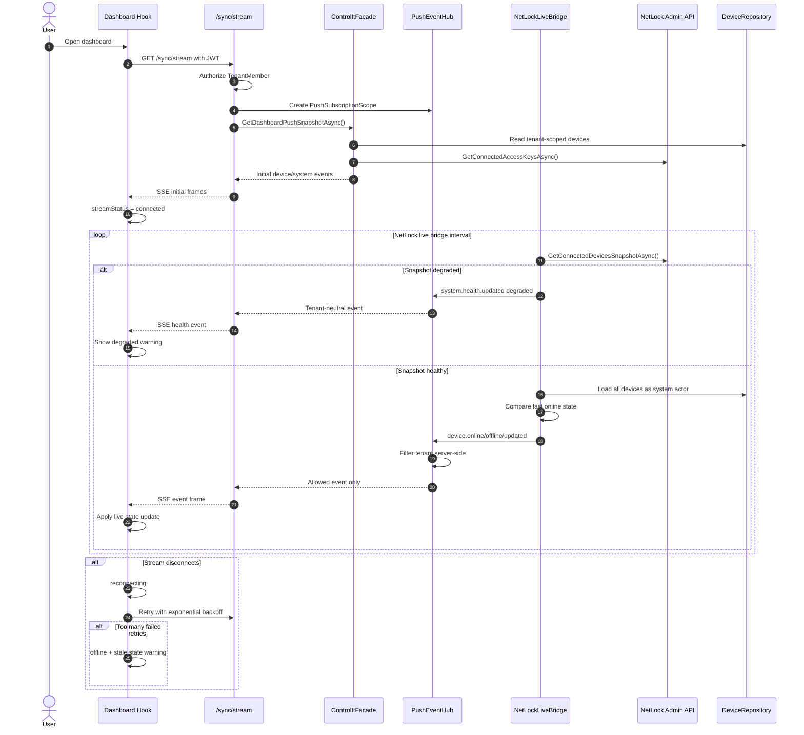

# SEQ2 - Dashboard Push Stream

```mermaid
sequenceDiagram
    autonumber
    actor User
    participant Web as Dashboard Hook
    participant API as /sync/stream
    participant Facade as ControlItFacade
    participant Hub as PushEventHub
    participant Bridge as NetLockLiveBridge
    participant NetLock as NetLock Admin API
    participant Repo as DeviceRepository

    User->>Web: Open dashboard
    Web->>API: GET /sync/stream with JWT
    API->>API: Authorize TenantMember
    API->>Hub: Create PushSubscriptionScope
    API->>Facade: GetDashboardPushSnapshotAsync()
    Facade->>Repo: Read tenant-scoped devices
    Facade->>NetLock: GetConnectedAccessKeysAsync()
    Facade-->>API: Initial device/system events
    API-->>Web: SSE initial frames
    Web->>Web: streamStatus = connected

    loop NetLock live bridge interval
        Bridge->>NetLock: GetConnectedDevicesSnapshotAsync()
        alt Snapshot degraded
            Bridge->>Hub: system.health.updated degraded
            Hub-->>API: Tenant-neutral event
            API-->>Web: SSE health event
            Web->>Web: Show degraded warning
        else Snapshot healthy
            Bridge->>Repo: Load all devices as system actor
            Bridge->>Bridge: Compare last online state
            Bridge->>Hub: device.online/offline/updated
            Hub->>Hub: Filter tenant server-side
            Hub-->>API: Allowed event only
            API-->>Web: SSE event frame
            Web->>Web: Apply live state update
        end
    end

    alt Stream disconnects
        Web->>Web: reconnecting
        Web->>API: Retry with exponential backoff
        alt Too many failed retries
            Web->>Web: offline + stale state warning
        end
    end
```

## Notes

- No polling fallback.
- Stream down means warning, not silent refresh loop.
- Tenant filtering happens on server before SSE frame is sent.
