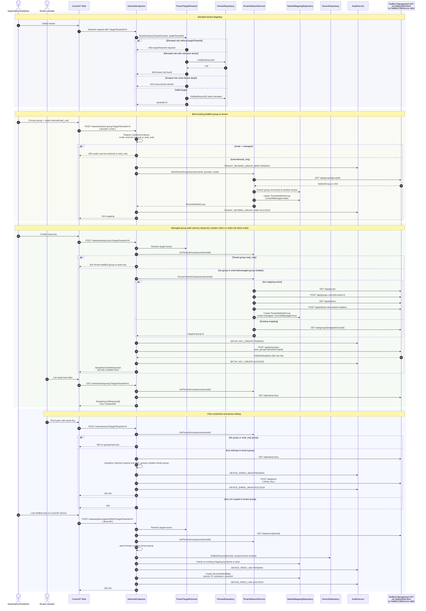

# SEQ3 - NetBird Tenant Onboarding

```mermaid
sequenceDiagram
    autonumber
    actor Admin as SuperAdmin/CpAdmin
    actor TenantUser as Tenant member
    participant Web as ControlIT Web
    participant Api as NetworkEndpoints
    participant Resolver as TenantTargetResolver
    participant Tenants as ITenantRepository
    participant Service as TenantNetworkService
    participant MapRepo as NetbirdMappingRepository
    participant Devices as DeviceRepository
    participant Audit as AuditService
    participant NetBird as NetBird Management API<br/>via NetbirdApiClient<br/>no NetBird DB/source edits

    rect rgb(245, 247, 250)
        Note over Admin,NetBird: Elevated tenant targeting
        Admin->>Web: Select tenant
        Web->>Api: Network request with ?targetTenantId=N
        Api->>Resolver: ResolveAsync(TenantContext, targetTenantId)
        alt Elevated role without targetTenantId
            Resolver-->>Api: 400 targetTenantId required
        else Elevated role with unknown tenant
            Resolver->>Tenants: GetByIdAsync(N)
            Tenants-->>Resolver: null
            Resolver-->>Api: 400 tenant not found
        else Scoped role cross-tenant target
            Resolver-->>Api: 403 cross-tenant denied
        else Valid target
            Resolver->>Tenants: GetByIdAsync(N) when elevated
            Resolver-->>Api: tenantId=N
        end
    end

    rect rgb(250, 250, 245)
        Note over Admin,NetBird: Bind existing NetBird group to tenant
        Admin->>Web: Choose group + mode external/read_only
        Web->>Api: POST /network/tenant-group?targetTenantId=N<br/>{ groupId, mode }
        Api->>Api: Require CpAdminOrAbove<br/>mode must be external or read_only
        alt mode = managed
            Api-->>Web: 400 mode must be external or read_only
        else external/read_only
            Api->>Audit: TENANT_NETBIRD_GROUP_BIND PENDING
            Api->>Service: BindTenantGroupAsync(tenantId, groupId, mode)
            Service->>NetBird: GET /api/groups/{groupId}
            NetBird-->>Service: NetbirdGroup or 404
            Service->>MapRepo: Ensure group not bound to another tenant
            Service->>MapRepo: Upsert TenantNetbirdGroup<br/>ControlItManaged=false
            Service-->>Api: TenantNetbirdGroup
            Api->>Audit: TENANT_NETBIRD_GROUP_BIND SUCCESS
            Api-->>Web: 200 mapping
        end
    end

    rect rgb(245, 250, 245)
        Note over Admin,NetBird: Managed group path used by setup-key creation when no read-only block exists
        Admin->>Web: Create setup key
        Web->>Api: POST /network/setup-keys?targetTenantId=N
        Api->>Resolver: Resolve target tenant
        Api->>Service: GetTenantGroupAsync(tenantId)
        alt Tenant group read_only
            Api-->>Web: 400 Tenant NetBird group is read-only
        else No group or external/managed group writable
            Api->>Service: EnsureTenantGroupAsync(tenantId)
            alt No mapping exists
                Service->>NetBird: GET /api/groups
                Service->>NetBird: POST /api/groups controlit-tenant-N
                Service->>NetBird: GET /api/policies
                Service->>NetBird: POST /api/policies intra-tenant isolation
                Service->>MapRepo: Create TenantNetbirdGroup<br/>mode=managed, ControlItManaged=true
            else Existing mapping
                Service->>NetBird: GET /api/groups/{mappedGroupId}
                Service-->>Api: mapped group id
            end
            Api->>Audit: SETUP_KEY_CREATE PENDING
            Api->>NetBird: POST /api/setup-keys<br/>auto_groups=[tenantGroupId]
            NetBird-->>Api: NetbirdSetupKey with raw key
            Api->>Audit: SETUP_KEY_CREATE SUCCESS
            Api-->>Web: SetupKeyCreateResponse<br/>raw key revealed once
        end

        TenantUser->>Web: List setup keys later
        Web->>Api: GET /network/setup-keys?targetTenantId=N
        Api->>Service: GetTenantGroupAsync(tenantId)
        Api->>NetBird: GET /api/setup-keys
        Api-->>Web: SetupKeyListResponse[]<br/>Key="[redacted]"
    end

    rect rgb(245, 248, 255)
        Note over TenantUser,NetBird: Peer enrollment and device linking
        TenantUser->>Web: Enrol peer with setup key
        Web->>Api: POST /network/enrol?targetTenantId=N
        Api->>Service: GetTenantGroupAsync(tenantId)
        alt No group or read_only group
            Api-->>Web: 400 no group/read-only
        else Key belongs to tenant group
            Api->>NetBird: GET /api/setup-keys
            Api->>Api: setupKey matches request and auto_groups contains tenant group
            Api->>Audit: DEVICE_ENROL_MESH PENDING
            Api->>NetBird: POST /api/peers<br/>{ setup_key }
            Api->>Audit: DEVICE_ENROL_MESH SUCCESS
            Api-->>Web: 200 OK
        else Key not scoped to tenant group
            Api-->>Web: 403
        end

        Admin->>Web: Link NetBird peer to ControlIT device
        Web->>Api: POST /network/peers/{peerId}/link?targetTenantId=N<br/>{ deviceId }
        Api->>Resolver: Resolve target tenant
        Api->>NetBird: GET /api/peers/{peerId}
        Api->>Service: GetTenantGroupAsync(tenantId)
        Api->>Api: peer.Groups contains tenant group
        Api->>Devices: GetByIdAsync(deviceId, scoped tenant context)
        Api->>MapRepo: Check no existing mapping by device or peer
        Api->>Audit: DEVICE_PEER_LINK PENDING
        Api->>MapRepo: Create DeviceNetbirdMap<br/>peerId, IP, hostname, deviceId
        Api->>Audit: DEVICE_PEER_LINK SUCCESS
        Api-->>Web: 200 OK
    end
```
