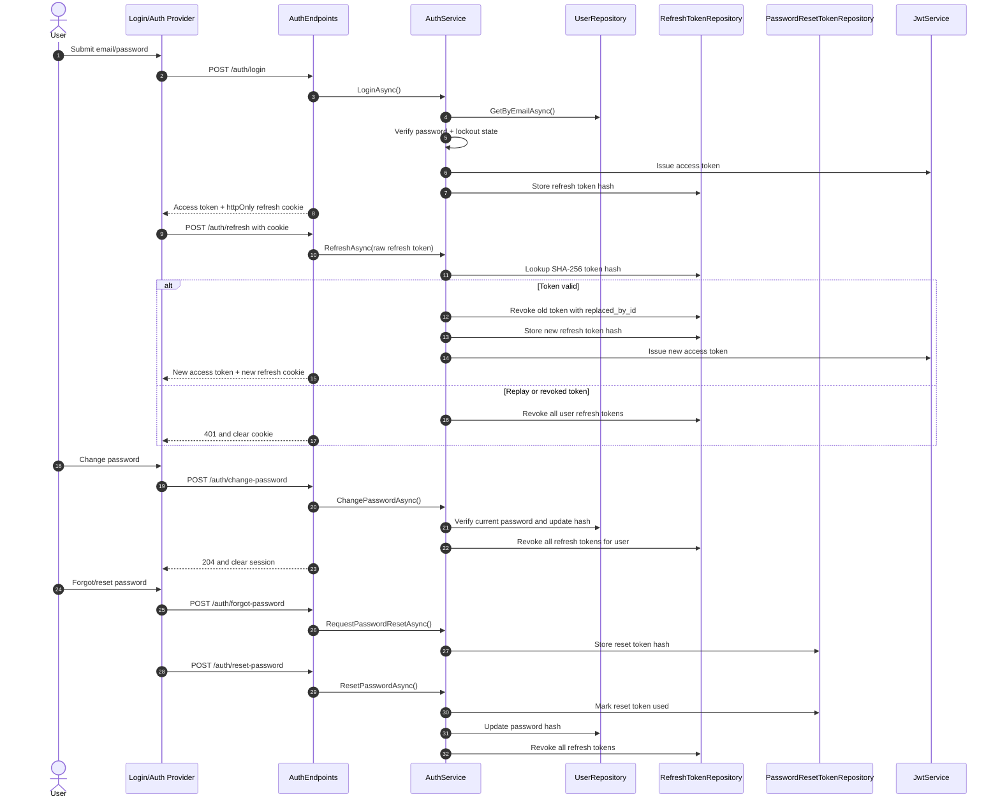

# SEQ4 - Auth Session

```mermaid
sequenceDiagram
    autonumber
    actor User
    participant Web as Login/Auth Provider
    participant API as AuthEndpoints
    participant Auth as AuthService
    participant Users as UserRepository
    participant Tokens as RefreshTokenRepository
    participant Reset as PasswordResetTokenRepository
    participant JWT as JwtService

    User->>Web: Submit email/password
    Web->>API: POST /auth/login
    API->>Auth: LoginAsync()
    Auth->>Users: GetByEmailAsync()
    Auth->>Auth: Verify password + lockout state
    Auth->>JWT: Issue access token
    Auth->>Tokens: Store refresh token hash
    API-->>Web: Access token + httpOnly refresh cookie

    Web->>API: POST /auth/refresh with cookie
    API->>Auth: RefreshAsync(raw refresh token)
    Auth->>Tokens: Lookup SHA-256 token hash
    alt Token valid
        Auth->>Tokens: Revoke old token with replaced_by_id
        Auth->>Tokens: Store new refresh token hash
        Auth->>JWT: Issue new access token
        API-->>Web: New access token + new refresh cookie
    else Replay or revoked token
        Auth->>Tokens: Revoke all user refresh tokens
        API-->>Web: 401 and clear cookie
    end

    User->>Web: Change password
    Web->>API: POST /auth/change-password
    API->>Auth: ChangePasswordAsync()
    Auth->>Users: Verify current password and update hash
    Auth->>Tokens: Revoke all refresh tokens for user
    API-->>Web: 204 and clear session

    User->>Web: Forgot/reset password
    Web->>API: POST /auth/forgot-password
    API->>Auth: RequestPasswordResetAsync()
    Auth->>Reset: Store reset token hash
    Web->>API: POST /auth/reset-password
    API->>Auth: ResetPasswordAsync()
    Auth->>Reset: Mark reset token used
    Auth->>Users: Update password hash
    Auth->>Tokens: Revoke all refresh tokens
```

## Notes

- Access token stays in frontend memory.
- Refresh token raw value stays in httpOnly cookie.
- Server stores only hashes for refresh/reset tokens.
