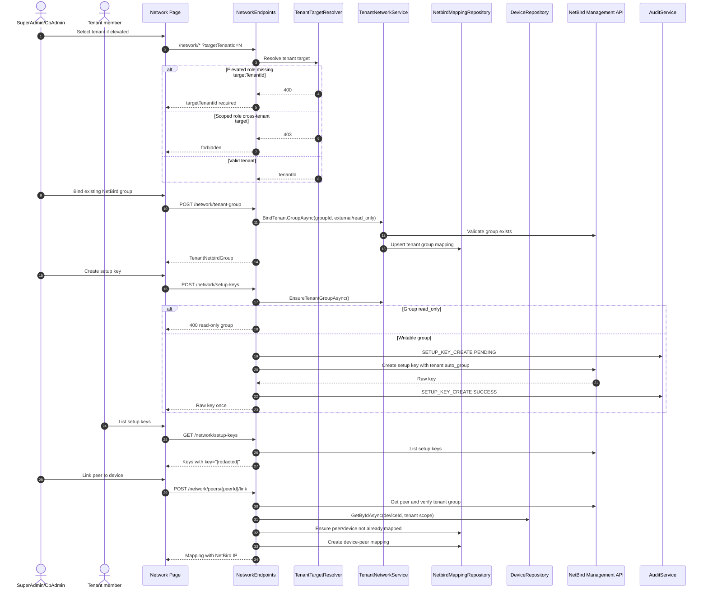

# SEQ3 - NetBird Tenant Onboarding

## Notes

- ControlIT uses NetBird API only.
- Setup key list never returns raw key.
- Peer link validates both peer tenant group and NetLock device tenant scope.
