```mermaid
flowchart LR

    %% ─────────────────────────────────────────────
    %% PRIMARY ACTORS (left side)
    %% ─────────────────────────────────────────────

    AuthUser(["&lt;&lt;abstract&gt;&gt;\nAuthenticated User"])
    CPAdmin(["Computer Port Admin"])
    ClientAdmin(["Client IT Admin"])
    Tech(["Technician"])
    ReconSvc(["&lt;&lt;system&gt;&gt;\nReconciliation Service"])

    %% Actor generalization — both Admin types and Technician inherit from Authenticated User
    CPAdmin -- "inherits" --> AuthUser
    ClientAdmin -- "inherits" --> AuthUser
    Tech -- "inherits" --> AuthUser

    %% ─────────────────────────────────────────────
    %% SYSTEM BOUNDARY
    %% ─────────────────────────────────────────────

    subgraph Platform ["Control IT Platform"]

        subgraph GroupA ["A — Identity & Access"]
            UCAuth["Authenticate (JWT)"]
            UCTenants["Manage Tenants"]
            UCRoles["Manage User Roles"]
            UCMFA["MFA Challenge"]
            UCDash["View Unified Dashboard"]
        end

        subgraph GroupB ["B — Endpoint Management  [NetLock RMM — Phase 1]"]
            UCInv["View Endpoint Inventory"]
            UCDetail["View Endpoint Detail"]
            UCCmd["Execute Remote Command"]
            UCSession["Launch Remote Session"]
            UCDeploy["Deploy Agent to Endpoint"]
            UCPatch["Manage Patch Updates"]
            UCTimeout["Handle Command Timeout"]
            UCUnavail["Handle Unavailable Agent"]
        end

        subgraph GroupC ["C — Network Management  [Netbird — Phase 1]"]
            UCNet["View Network Topology"]
            UCPeers["View Peer Status"]
            UCEnrol["Enrol Device to Mesh"]
            UCACLs["Manage Network ACL Rules"]
        end

        subgraph GroupD ["D — Device Identity  [controlit_device_map — Phase 1]"]
            UCReconcile["Reconcile Device Identity"]
            UCResolve["Resolve Cross-Tool Device"]
            UCOverride["Override Device Correlation"]
        end

        subgraph GroupE ["E — Audit & Reporting"]
            UCAudit["View Audit Logs"]
            UCRecord["Record Audit Event"]
            UCSummary["View Unified Dashboard Summary"]
            UCExport["Export Report (PDF)"]
        end

        subgraph GroupF ["F — Security & Compliance  [Wazuh — Phase 2]"]
            UCAlerts["View Security Alerts  [Phase 2]"]
            UCCompliance["View Compliance Status  [Phase 2]"]
            UCVuln["View Vulnerability Report  [Phase 2]"]
            UCResponse["Trigger Active Response  [Phase 2]"]
        end

    end

    %% ─────────────────────────────────────────────
    %% SECONDARY ACTORS (right side)
    %% ─────────────────────────────────────────────

    NetLock(["&lt;&lt;external&gt;&gt;\nNetLock RMM Server"])
    Endpoint(["&lt;&lt;device&gt;&gt;\nManaged Endpoint"])
    Netbird(["&lt;&lt;external&gt;&gt;\nNetbird Management"])
    Wazuh(["&lt;&lt;external&gt;&gt;\nWazuh Manager\n[Phase 2]"])
    SMTP(["&lt;&lt;external&gt;&gt;\nSMTP Server"])
    MySQL(["&lt;&lt;database&gt;&gt;\nMySQL Database"])

    %% ─────────────────────────────────────────────
    %% COMPUTER PORT ADMIN → USE CASES
    %% ─────────────────────────────────────────────

    CPAdmin --> UCAuth
    CPAdmin --> UCTenants
    CPAdmin --> UCRoles
    CPAdmin --> UCDash
    CPAdmin --> UCInv
    CPAdmin --> UCCmd
    CPAdmin --> UCSession
    CPAdmin --> UCDeploy
    CPAdmin --> UCPatch
    CPAdmin --> UCNet
    CPAdmin --> UCPeers
    CPAdmin --> UCEnrol
    CPAdmin --> UCACLs
    CPAdmin --> UCOverride
    CPAdmin --> UCAudit
    CPAdmin --> UCSummary
    CPAdmin --> UCExport
    CPAdmin --> UCAlerts
    CPAdmin --> UCCompliance
    CPAdmin --> UCResponse

    %% ─────────────────────────────────────────────
    %% CLIENT IT ADMIN → USE CASES
    %% Scoped to own tenant only.
    %% Cannot: Manage Tenants, Manage User Roles,
    %%          View Audit Logs, Override Device Correlation.
    %% ─────────────────────────────────────────────

    ClientAdmin --> UCAuth
    ClientAdmin --> UCDash
    ClientAdmin --> UCInv
    ClientAdmin --> UCDetail
    ClientAdmin --> UCPeers
    ClientAdmin --> UCAlerts
    ClientAdmin --> UCCompliance
    ClientAdmin --> UCSummary

    %% ─────────────────────────────────────────────
    %% TECHNICIAN → USE CASES
    %% Scoped to assigned clients only. No management operations.
    %% ─────────────────────────────────────────────

    Tech --> UCAuth
    Tech --> UCInv
    Tech --> UCDetail
    Tech --> UCCmd
    Tech --> UCSession
    Tech --> UCDeploy
    Tech --> UCPatch
    Tech --> UCEnrol

    %% ─────────────────────────────────────────────
    %% RECONCILIATION SERVICE → USE CASES
    %% Background initiator — system-initiated, no human trigger.
    %% ─────────────────────────────────────────────

    ReconSvc --> UCReconcile
    ReconSvc --> UCResolve

    %% ─────────────────────────────────────────────
    %% USE CASES → SECONDARY ACTORS
    %% ─────────────────────────────────────────────

    UCInv --> NetLock
    UCCmd --> NetLock
    UCDeploy --> NetLock
    UCCmd --> Endpoint
    UCSession --> Endpoint
    UCNet --> Netbird
    UCPeers --> Netbird
    UCEnrol --> Netbird
    UCAlerts --> Wazuh
    UCCompliance --> Wazuh
    UCVuln --> Wazuh
    UCRecord --> SMTP
    UCAuth --> MySQL
    UCInv --> MySQL
    UCRecord --> MySQL

    %% ─────────────────────────────────────────────
    %% INCLUDE RELATIONSHIPS  («include»)
    %% ─────────────────────────────────────────────

    UCAuth -. "«include»" .-> UCMFA
    UCDash -. "«include»" .-> UCAuth
    UCDash -. "«include»" .-> UCInv
    UCDash -. "«include»" .-> UCNet
    UCCmd -. "«include»" .-> UCRecord
    UCSession -. "«include»" .-> UCRecord
    UCTenants -. "«include»" .-> UCRecord
    UCRoles -. "«include»" .-> UCRecord
    UCResponse -. "«include»" .-> UCAlerts

    %% ─────────────────────────────────────────────
    %% EXTEND RELATIONSHIPS  («extend»)
    %% ─────────────────────────────────────────────

    UCSession -. "«extend»" .-> UCInv
    UCVuln -. "«extend»" .-> UCDetail
    UCTimeout -. "«extend»" .-> UCCmd
    UCUnavail -. "«extend»" .-> UCCmd
    UCOverride -. "«extend»" .-> UCReconcile
    UCExport -. "«extend»" .-> UCAudit
```

# UC1 — Control IT: High-Level Use Case Diagram

**Scope:** Full system — all actors, all use cases, system boundary.
**Source:** Converted from `UC1-Control-IT-Overall.puml` (PlantUML).
**Note:** Mermaid has no native use case diagram type. This uses `flowchart LR` with actor nodes and labeled edges. Phase 2 items are labeled `[Phase 2]`.

---

---

## Actor Notes

| Actor | Scope | Restrictions |
|-------|-------|-------------|
| Computer Port Admin | All tenants, all use cases | None. Full system access. |
| Client IT Admin | Own tenant only | Cannot: Manage Tenants, Manage User Roles, View Audit Logs, Override Device Correlation. |
| Technician | Assigned clients only | Read + execution only. No management operations of any kind. |
| Reconciliation Service | Background | System-initiated. Maps `netlock_agent_id` ↔ `netbird_peer_id` ↔ `wazuh_agent_id` ↔ `client_id`. |

**Actor generalization:** `Computer Port Admin`, `Client IT Admin`, and `Technician` all inherit from abstract `Authenticated User`. `Client IT Admin` does NOT inherit from `Computer Port Admin` — they are siblings under the same abstract base.
