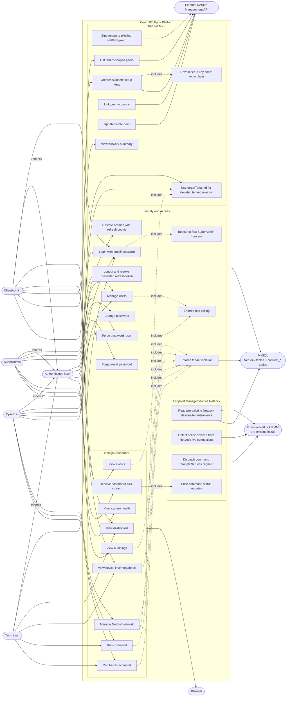

# UC1 - ControlIT Alpha: High-Level Use Case Diagram

**Scope:** Current alpha app across dashboard, API layer, NetLock, NetBird, and ControlIT-owned persistence.

```mermaid
flowchart LR
    AuthUser(["Authenticated User"])
    SuperAdmin(["SuperAdmin"])
    CpAdmin(["CpAdmin"])
    ClientAdmin(["ClientAdmin"])
    Tech(["Technician"])

    SuperAdmin -- "inherits" --> AuthUser
    CpAdmin -- "inherits" --> AuthUser
    ClientAdmin -- "inherits" --> AuthUser
    Tech -- "inherits" --> AuthUser

    subgraph Platform ["ControlIT Alpha Platform"]
        subgraph Identity ["Identity and Access"]
            Login["Login with email/password"]
            Refresh["Restore session with refresh cookie"]
            Logout["Logout and revoke presented refresh token"]
            ChangePwd["Change password"]
            ResetPwd["Forgot/reset password"]
            Bootstrap["Bootstrap first SuperAdmin from env"]
            ManageUsers["Manage users"]
            ForceReset["Force password reset"]
            RoleCeiling["Enforce role ceiling"]
            TenantScope["Enforce tenant isolation"]
        end

        subgraph Dashboard ["Next.js Dashboard"]
            ViewDash["View dashboard"]
            StreamDash["Receive dashboard SSE stream"]
            ViewDevices["View device inventory/detail"]
            ViewEvents["View events"]
            ViewAudit["View audit logs"]
            ManageNetwork["Manage NetBird network"]
            RunCommand["Run command"]
            RunBatch["Run batch command"]
            ViewSystem["View system health"]
        end

        subgraph NetLockUse ["Endpoint Management via NetLock"]
            ReadNetLock["Read pre-existing NetLock devices/tenants/events"]
            DetectOnline["Detect online devices from NetLock live connections"]
            DispatchSignalR["Dispatch command through NetLock SignalR"]
            CommandStatus["Push command status updates"]
        end

        subgraph NetBirdUse ["NetBird MVP"]
            BindTenantGroup["Bind tenant to existing NetBird group"]
            ListPeers["List tenant-scoped peers"]
            SetupKeys["Create/list/delete setup keys"]
            OneTimeKey["Reveal setup key once; redact later"]
            LinkPeer["Link peer to device"]
            UpdatePeer["Update/delete peer"]
            NetworkSummary["View network summary"]
            ElevatedTarget["Use targetTenantId for elevated tenant selection"]
        end
    end

    NetLock(["External NetLock RMM\npre-existing install"])
    NetBird(["External NetBird Management API"])
    MySQL(["MySQL\nNetLock tables + controlit_* tables"])
    Browser(["Browser"])

    SuperAdmin --> Login
    SuperAdmin --> ManageUsers
    SuperAdmin --> ForceReset
    SuperAdmin --> ViewSystem
    SuperAdmin --> ViewAudit
    SuperAdmin --> ElevatedTarget

    CpAdmin --> Login
    CpAdmin --> ManageUsers
    CpAdmin --> ForceReset
    CpAdmin --> ElevatedTarget
    CpAdmin --> ManageNetwork
    CpAdmin --> RunCommand
    CpAdmin --> RunBatch

    ClientAdmin --> Login
    ClientAdmin --> ViewDash
    ClientAdmin --> ViewDevices
    ClientAdmin --> ViewEvents
    ClientAdmin --> ListPeers
    ClientAdmin --> SetupKeys
    ClientAdmin --> NetworkSummary

    Tech --> Login
    Tech --> ViewDash
    Tech --> ViewDevices
    Tech --> RunCommand
    Tech --> RunBatch

    AuthUser --> Refresh
    AuthUser --> Logout
    AuthUser --> ChangePwd
    AuthUser --> ResetPwd
    AuthUser --> StreamDash

    Login -. "includes" .-> Bootstrap
    ManageUsers -. "includes" .-> RoleCeiling
    ForceReset -. "includes" .-> RoleCeiling
    ViewDevices -. "includes" .-> TenantScope
    ViewEvents -. "includes" .-> TenantScope
    ViewAudit -. "includes" .-> TenantScope
    RunCommand -. "includes" .-> TenantScope
    RunBatch -. "includes" .-> TenantScope
    ManageNetwork -. "includes" .-> TenantScope
    ManageNetwork -. "includes" .-> ElevatedTarget
    SetupKeys -. "includes" .-> OneTimeKey
    StreamDash -. "includes" .-> CommandStatus

    ReadNetLock --> NetLock
    DetectOnline --> NetLock
    DispatchSignalR --> NetLock
    BindTenantGroup --> NetBird
    ListPeers --> NetBird
    SetupKeys --> NetBird
    LinkPeer --> NetBird
    UpdatePeer --> NetBird
    Identity --> MySQL
    Dashboard --> Browser
    ReadNetLock --> MySQL
    TenantScope --> MySQL
```

## Actor Notes

| Actor | Scope | Current alpha restrictions |
|-------|-------|----------------------------|
| SuperAdmin | All tenants | May manage lower roles only; cannot manage another SuperAdmin. |
| CpAdmin | All tenants | Must pass `targetTenantId` on tenant-scoped NetBird operations; cannot manage CpAdmin or SuperAdmin. |
| ClientAdmin | Own tenant | Tenant isolation uses JWT `tenant_id`; cross-tenant `targetTenantId` returns 403. |
| Technician | Own tenant / assigned work | Can execute commands and batch commands; no user or NetBird management mutations. |

## Boundary Notes

- ControlIT is API/dashboard layer. NetLock is assumed already installed and owned by vendor stack.
- Dapper reads NetLock-owned tables. EF Core owns only `controlit_*` tables.
- NetBird MVP uses external or read-only tenant group binding plus managed group creation for setup-key creation when needed.
- Dashboard keeps access token in memory and relies on httpOnly `refresh_token` cookie for refresh.
