```mermaid
flowchart LR

    %% ─────────────────────────────────────────────
    %% PRIMARY ACTORS (left side — callers / initiators)
    %% ─────────────────────────────────────────────

    DashUser(["Dashboard User"])
    Dashboard(["&lt;&lt;system&gt;&gt;\nControl IT Dashboard\nNext.js"])
    Attacker(["&lt;&lt;threat&gt;&gt;\nAttacker\ncompromised key"])

    DashUser --> Dashboard

    %% ─────────────────────────────────────────────
    %% SYSTEM BOUNDARY — ControlIT.Api
    %% ─────────────────────────────────────────────

    subgraph API ["ControlIT.Api  (ASP.NET Core — Minimal APIs)"]

        subgraph Group1 ["1 — Startup & Health  [Phase 1]"]
            UCSchema["Validate NetLock Schema"]
            UCConnect["Connect to SignalR Hub"]
            UCHealth["Health Check"]
            UCMismatch["Handle Schema Mismatch"]
        end

        subgraph Group2 ["2 — Auth & Tenant Resolution  [cross-cutting]"]
            UCValidKey["Validate API Key"]
            UCResolve["Resolve API Key to Tenant"]
            UCLogin["POST /auth/login"]
            UCRefresh["POST /auth/refresh"]
            UCLogout["POST /auth/logout"]
        end

        subgraph Group3 ["3 — Device Queries  [sync — DB reads, tenant-scoped]"]
            UCListDev["GET /devices"]
            UCGetDev["GET /devices/{id}"]
            UCMetrics["GET /devices/metrics"]
            UCCompliance["GET /devices/compliance"]
            UCTenants["GET /tenants"]
            UCCreateTenant["POST /tenants"]
        end

        subgraph Group4 ["4 — Command Dispatch  [async — SignalR, up to 30s]"]
            UCExec["POST /commands/execute"]
            UCStatus["GET /commands/status"]
            UCCmdResp["Receive Command Response"]
            UCCmdTimeout["Handle Command Timeout"]
            UCDisconnect["Handle SignalR Disconnected"]
        end

        subgraph Group5 ["5 — Network Queries  [sync — Netbird REST, Phase 1]"]
            UCPeers["GET /network/peers"]
            UCPolicy["POST /network/policy"]
            UCDelPeer["DELETE /network/peer/{id}"]
        end

        subgraph Group6 ["6 — Events & Alerts"]
            UCEvents["GET /events"]
            UCWazuhAlerts["GET /alerts/wazuh  [Phase 2]"]
            UCAck["POST /alerts/acknowledge  [Phase 2]"]
        end

        subgraph Group7 ["7 — Audit Log  [cross-cutting]"]
            UCAuditGet["GET /audit/logs"]
            UCAuditExport["GET /audit/logs/export"]
            UCRecord["Record Audit Event"]
        end

        subgraph RateLimit ["Rate Limiting  [threat mitigation]"]
            UCRateLimit["Rate Limit / Block"]
        end

    end

    %% ─────────────────────────────────────────────
    %% SECONDARY ACTORS (right side — external dependencies)
    %% ─────────────────────────────────────────────

    SignalR(["&lt;&lt;system&gt;&gt;\nNetLock SignalR Hub"])
    NetLockAdmin(["&lt;&lt;system&gt;&gt;\nNetLock Admin REST\n/admin/devices/connected"])
    MySQL(["&lt;&lt;database&gt;&gt;\nMySQL Database"])
    NetbirdAPI(["&lt;&lt;external&gt;&gt;\nNetbird REST API"])
    WazuhAPI(["&lt;&lt;external&gt;&gt;\nWazuh REST API\n[Phase 2]"])
    Redis(["&lt;&lt;cache&gt;&gt;\nRedis Cache\n[Phase 2]"])

    %% ─────────────────────────────────────────────
    %% DASHBOARD → USE CASES
    %% ─────────────────────────────────────────────

    Dashboard --> UCLogin
    Dashboard --> UCRefresh
    Dashboard --> UCLogout
    Dashboard --> UCListDev
    Dashboard --> UCGetDev
    Dashboard --> UCMetrics
    Dashboard --> UCCompliance
    Dashboard --> UCTenants
    Dashboard --> UCExec
    Dashboard --> UCStatus
    Dashboard --> UCPeers
    Dashboard --> UCPolicy
    Dashboard --> UCEvents
    Dashboard --> UCWazuhAlerts
    Dashboard --> UCAuditGet
    Dashboard --> UCAuditExport
    Dashboard --> UCHealth

    Attacker --> UCRateLimit

    %% ─────────────────────────────────────────────
    %% USE CASES → SECONDARY ACTORS
    %% ─────────────────────────────────────────────

    UCSchema --> MySQL
    UCConnect --> SignalR
    UCLogin --> MySQL
    UCRefresh --> MySQL
    UCListDev --> MySQL
    UCListDev --> NetLockAdmin
    UCGetDev --> MySQL
    UCGetDev --> NetLockAdmin
    UCMetrics --> Redis
    UCCompliance --> MySQL
    UCTenants --> MySQL
    UCCreateTenant --> MySQL
    UCExec --> MySQL
    UCExec --> NetLockAdmin
    UCExec --> SignalR
    UCCmdResp --> SignalR
    UCEvents --> MySQL
    UCPeers --> NetbirdAPI
    UCPolicy --> NetbirdAPI
    UCDelPeer --> NetbirdAPI
    UCWazuhAlerts --> WazuhAPI
    UCAck --> WazuhAPI
    UCAuditGet --> MySQL
    UCAuditExport --> MySQL
    UCRecord --> MySQL
    UCValidKey --> MySQL
    UCResolve --> MySQL

    %% ─────────────────────────────────────────────
    %% INCLUDE RELATIONSHIPS  («include»)
    %% Every Group 3 device query includes Validate + Resolve.
    %% Every state-mutating call includes Record Audit Event.
    %% ─────────────────────────────────────────────

    UCListDev -. "«include»" .-> UCValidKey
    UCListDev -. "«include»" .-> UCResolve
    UCGetDev -. "«include»" .-> UCValidKey
    UCGetDev -. "«include»" .-> UCResolve
    UCMetrics -. "«include»" .-> UCValidKey
    UCMetrics -. "«include»" .-> UCResolve
    UCCompliance -. "«include»" .-> UCValidKey
    UCCompliance -. "«include»" .-> UCResolve
    UCExec -. "«include»" .-> UCValidKey
    UCExec -. "«include»" .-> UCResolve
    UCPeers -. "«include»" .-> UCValidKey
    UCEvents -. "«include»" .-> UCValidKey
    UCEvents -. "«include»" .-> UCResolve
    UCWazuhAlerts -. "«include»" .-> UCValidKey
    UCWazuhAlerts -. "«include»" .-> UCResolve
    UCAuditGet -. "«include»" .-> UCValidKey
    UCAuditGet -. "«include»" .-> UCResolve

    UCExec -. "«include»" .-> UCRecord
    UCPolicy -. "«include»" .-> UCRecord
    UCDelPeer -. "«include»" .-> UCRecord
    UCCreateTenant -. "«include»" .-> UCRecord
    UCAck -. "«include»" .-> UCRecord

    %% ─────────────────────────────────────────────
    %% EXTEND RELATIONSHIPS  («extend»)
    %% ─────────────────────────────────────────────

    UCMismatch -. "«extend»" .-> UCConnect
    UCCmdTimeout -. "«extend»" .-> UCExec
    UCDisconnect -. "«extend»" .-> UCExec
    UCRateLimit -. "«extend»" .-> UCLogin
    UCRateLimit -. "«extend»" .-> UCExec
```

# UC2 — ControlIT.Api: REST API Layer Drill-Down

**Scope:** ControlIT.Api internals — how the API layer satisfies use cases, auth enforcement, sync vs async distinction, phase boundaries, external system dependencies per group.
**Source:** Converted from `UC2-API-Layer.puml` (PlantUML).
**Note:** Mermaid has no native use case diagram type. This uses `flowchart LR` with actor nodes and labeled edges. Phase 2 items are labeled `[Phase 2]`.

---

---

## Key Design Notes

| Use Case | Type | Notes |
|----------|------|-------|
| Validate API Key | Cross-cutting | Every request except `/health` passes through `ApiKeyMiddleware`. `tenant_id` is NEVER trusted from the client — always derived server-side from the key lookup (P0 security fix). |
| POST /commands/execute | Async only | HTTP POST triggers a SignalR invocation on NetLock `commandHub`. Response resolved by `device_id`-keyed `_pendingCommands` (NetLock callback delivers `"device_id>>nlocksep<<output"` — `device_id` is the only identifier returned; one pending command per device, 409 on collision). Max wait: 30s — then `Handle Command Timeout` fires. |
| GET /devices (all Group 3) | Sync, tenant-scoped | `TenantContext` middleware enforces `WHERE tenant_id = ?` on every query. `IsOnline` per device is resolved by calling NetLock's `GET /admin/devices/connected` (returns in-memory SignalR hub state) — same source NetLock's own web console uses. `last_access` is NOT used for online detection. |
| GET /alerts/wazuh | Phase 2 | Requires Wazuh Manager deployed and REST API configured. `WazuhApiClient` registered in DI only when `Wazuh:Enabled = true`. |
