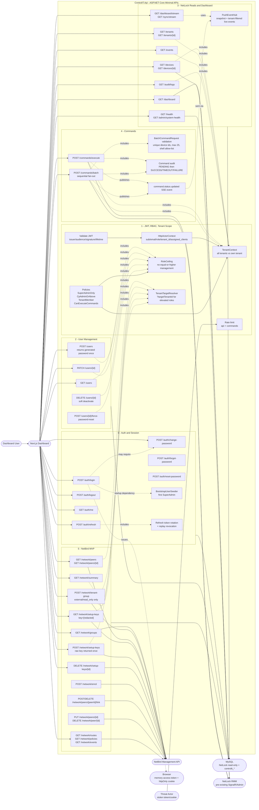

# UC2 - ControlIT.Api Alpha: REST API Layer Drill-Down

**Scope:** Current frontend-facing API layer, JWT auth, tenant scoping, NetLock boundary, NetBird MVP, dashboard push state, batch command flow.

```mermaid
flowchart LR
    User(["Dashboard User"])
    Web(["Next.js Dashboard"])
    Threat(["Threat Actor\nstolen token/cookie"])
    User --> Web

    subgraph API ["ControlIT.Api - ASP.NET Core Minimal APIs"]
        subgraph Auth ["0 - Auth and Session"]
            Login["POST /auth/login"]
            Refresh["POST /auth/refresh"]
            Logout["POST /auth/logout"]
            ChangePwd["POST /auth/change-password"]
            ForgotPwd["POST /auth/forgot-password"]
            ResetPwd["POST /auth/reset-password"]
            Me["GET /auth/me"]
            Bootstrap["BootstrapUserSeeder\nfirst SuperAdmin"]
            RefreshRotate["Refresh token rotation\n+ replay revocation"]
        end

        subgraph RBAC ["1 - JWT, RBAC, Tenant Scope"]
            ValidateJwt["Validate JWT\nissuer/audience/signature/lifetime"]
            ActorCtx["HttpActorContext\nsub/email/role/tenant_id/assigned_clients"]
            TenantCtx["TenantContext\nall tenants vs own tenant"]
            Policies["Policies\nSuperAdminOnly\nCpAdminOrAbove\nTenantMember\nCanExecuteCommands"]
            RoleCeiling["RoleCeiling\nno equal-or-higher management"]
            TenantTarget["TenantTargetResolver\n?targetTenantId for elevated roles"]
            RateLimit["Rate limit\napi + commands"]
        end

        subgraph Users ["2 - User Management"]
            ListUsers["GET /users"]
            CreateUser["POST /users\nreturns generated password once"]
            PatchUser["PATCH /users/{id}"]
            DeleteUser["DELETE /users/{id}\nsoft deactivate"]
            ForceReset["POST /users/{id}/force-password-reset"]
        end

        subgraph Reads ["3 - NetLock Reads and Dashboard"]
            Dashboard["GET /dashboard"]
            Stream["GET /dashboard/stream\nGET /sync/stream"]
            Devices["GET /devices\nGET /devices/{id}"]
            Tenants["GET /tenants\nGET /tenants/{id}"]
            Events["GET /events"]
            Audit["GET /audit/logs"]
            Health["GET /health\nGET /admin/system-health"]
            Push["PushEventHub\nsnapshot + tenant-filtered live events"]
        end

        subgraph Commands ["4 - Commands"]
            Execute["POST /commands/execute"]
            Batch["POST /commands/batch\nsequential fan-out"]
            ValidateBatch["BatchCommandRequest validation\nunique device ids, max 25, shell allow-list"]
            CmdAudit["Command audit\nPENDING then SUCCESS/TIMEOUT/FAILURE"]
            CmdPush["command.status.updated SSE event"]
        end

        subgraph Network ["5 - NetBird MVP"]
            Groups["GET /network/groups"]
            BindGroup["POST /network/tenant-group\nexternal/read_only only"]
            Peers["GET /network/peers\nGET /network/peers/{id}"]
            SetupList["GET /network/setup-keys\nkey=[redacted]"]
            SetupCreate["POST /network/setup-keys\nraw key returned once"]
            SetupDelete["DELETE /network/setup-keys/{id}"]
            Enrol["POST /network/enrol"]
            Link["POST/DELETE /network/peers/{peerId}/link"]
            PeerMutate["PUT /network/peers/{id}\nDELETE /network/peer/{id}"]
            NetworkSummary["GET /network/summary"]
            RoutesPoliciesEvents["GET /network/routes\nGET /network/policies\nGET /network/events"]
        end
    end

    MySQL(["MySQL\nNetLock read-only + controlit_*"])
    NetLock(["NetLock RMM\npre-existing SignalR/Admin"])
    NetBird(["NetBird Management API"])
    Browser(["Browser\nmemory access token + httpOnly cookie"])

    Web --> Login
    Web --> Refresh
    Web --> Logout
    Web --> ChangePwd
    Web --> Me
    Web --> ListUsers
    Web --> CreateUser
    Web --> PatchUser
    Web --> Dashboard
    Web --> Stream
    Web --> Devices
    Web --> Tenants
    Web --> Events
    Web --> Audit
    Web --> Execute
    Web --> Batch
    Web --> Groups
    Web --> BindGroup
    Web --> Peers
    Web --> SetupList
    Web --> SetupCreate
    Web --> SetupDelete
    Web --> NetworkSummary
    Web --> RoutesPoliciesEvents
    Web --> Health
    Threat --> RateLimit

    Login -. "issues" .-> Browser
    Refresh -. "includes" .-> RefreshRotate
    Login -. "may require" .-> ChangePwd
    Login -. "startup dependency" .-> Bootstrap

    ListUsers -. "includes" .-> RoleCeiling
    CreateUser -. "includes" .-> RoleCeiling
    PatchUser -. "includes" .-> RoleCeiling
    DeleteUser -. "includes" .-> RoleCeiling
    ForceReset -. "includes" .-> RoleCeiling

    Devices -. "includes" .-> TenantCtx
    Tenants -. "includes" .-> TenantCtx
    Events -. "includes" .-> TenantCtx
    Audit -. "includes" .-> TenantCtx
    Execute -. "includes" .-> TenantCtx
    Batch -. "includes" .-> TenantCtx
    Peers -. "includes" .-> TenantTarget
    SetupList -. "includes" .-> TenantTarget
    SetupCreate -. "includes" .-> TenantTarget
    BindGroup -. "includes" .-> TenantTarget
    NetworkSummary -. "includes" .-> TenantTarget

    Batch -. "includes" .-> ValidateBatch
    Execute -. "includes" .-> CmdAudit
    Batch -. "includes" .-> CmdAudit
    Execute -. "publishes" .-> CmdPush
    Batch -. "publishes" .-> CmdPush
    Stream -. "uses" .-> Push
    CmdPush -. "sent via" .-> Push

    ValidateJwt --> ActorCtx
    ActorCtx --> TenantCtx
    Policies --> RoleCeiling
    Policies --> TenantCtx

    Auth --> MySQL
    Users --> MySQL
    Reads --> MySQL
    Network --> MySQL
    Execute --> NetLock
    Batch --> NetLock
    Dashboard --> NetLock
    Devices --> NetLock
    Health --> NetLock
    Groups --> NetBird
    BindGroup --> NetBird
    Peers --> NetBird
    SetupList --> NetBird
    SetupCreate --> NetBird
    SetupDelete --> NetBird
    Enrol --> NetBird
    Link --> NetBird
    PeerMutate --> NetBird
    RoutesPoliciesEvents --> NetBird
```

## Key Accuracy Notes

| Area | Current behavior |
|------|------------------|
| Auth | Access token is returned in JSON and held in frontend memory. Refresh token is stored as SHA-256 hash server-side and raw value is sent as httpOnly `refresh_token` cookie. |
| Refresh | Successful refresh creates new token row, revokes old row with `replaced_by_id`, returns new access token, and overwrites refresh cookie. Replaying a revoked token revokes all refresh tokens for that user. |
| Role ceiling | `RoleCeiling.CanManage(actor, target)` blocks equal-or-higher role management for create, patch, deactivate, and force-reset. |
| Tenant isolation | Normal tenant reads use JWT tenant scope. Elevated NetBird calls require `targetTenantId`; scoped users cannot override to another tenant. |
| Setup keys | `POST /network/setup-keys` returns raw key once. `GET /network/setup-keys` always returns `"[redacted]"`. |
| Dashboard stream | `/dashboard/stream` and `/sync/stream` send initial dashboard/device/system snapshot then tenant-filtered `PushEventHub` events. |
| Batch commands | `/commands/batch` validates request then fans out through same command execution path per device, producing per-device audit + push status. |
| Production boundary | NetLock is not created or rewritten by ControlIT. It must already exist; ControlIT reads NetLock DB tables and calls NetLock SignalR/Admin surfaces. |
