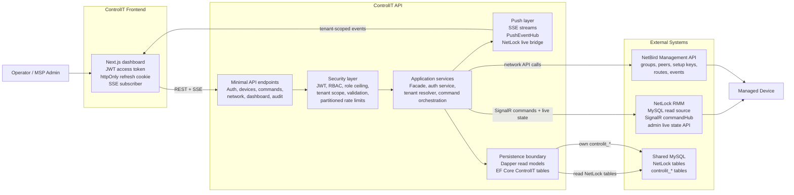
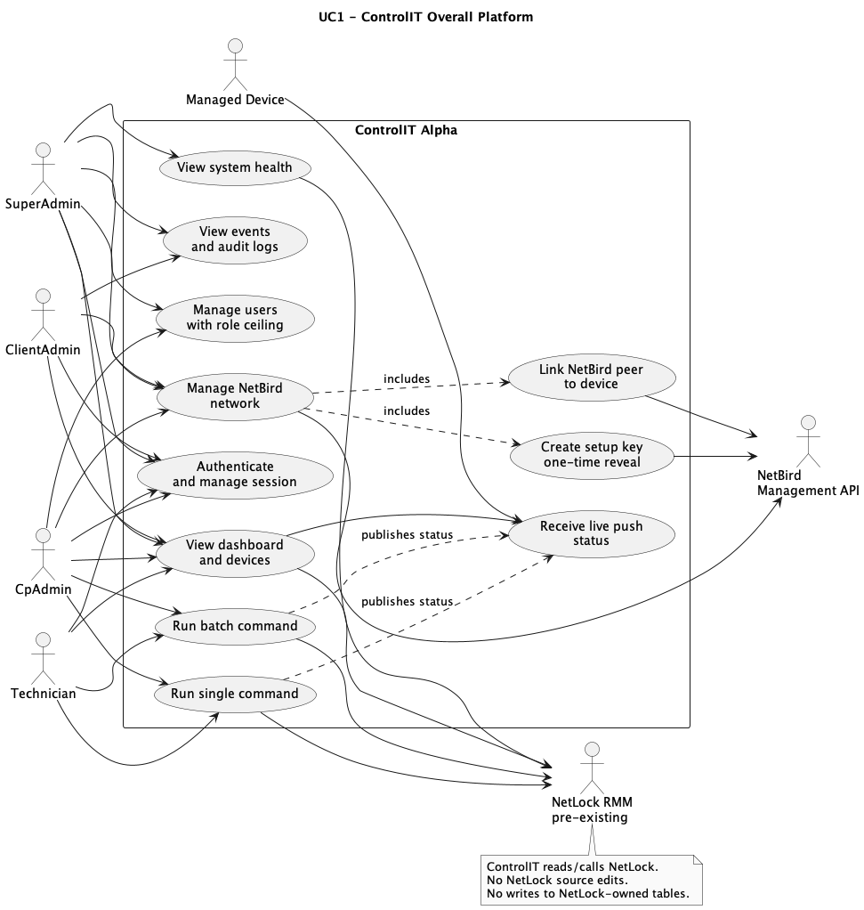
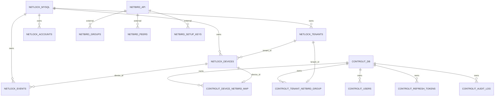
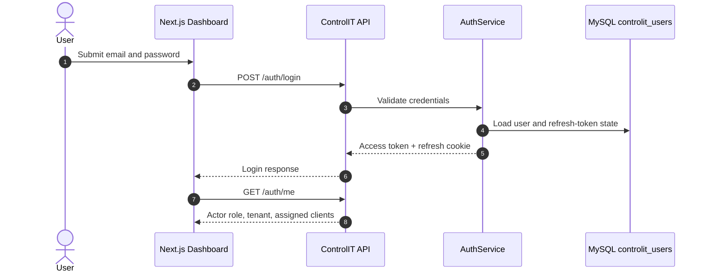
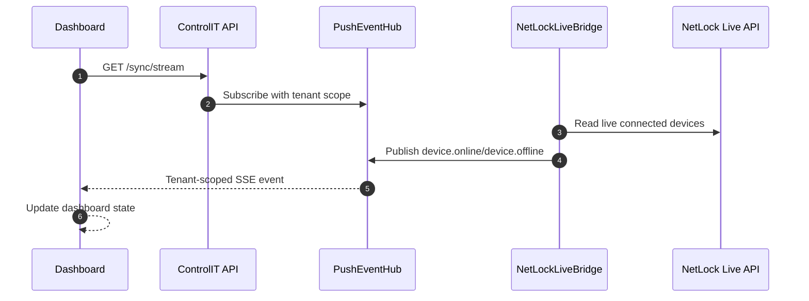
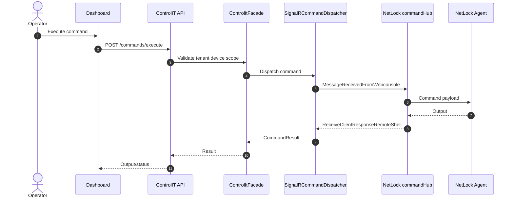

# ControlIT: NetLock RMM API Layer and Operations Dashboard

**Final Technical Project Report**  
**Course:** System Design and Software Engineering  
**Project Type:** Existing system extension and product alpha release  
**Repository:** [mahir-m01/NetLock-RMM-API-Layer](https://github.com/mahir-m01/NetLock-RMM-API-Layer)  
**Release Branch:** [`production`](https://github.com/mahir-m01/NetLock-RMM-API-Layer/tree/production)  
**Alpha Release:** [`v0.1.0-alpha.1`](https://github.com/mahir-m01/NetLock-RMM-API-Layer/releases/tag/v0.1.0-alpha.1)  

---

## Contents

1. [Executive Summary](#1-executive-summary)
2. [Problem Statement and Motivation](#2-problem-statement-and-motivation)
3. [Project Scope](#3-project-scope)
4. [System Architecture](#4-system-architecture)
5. [Domain Model and Data Ownership](#5-domain-model-and-data-ownership)
6. [API Layer Design](#6-api-layer-design)
7. [Key Runtime Flows](#7-key-runtime-flows)
8. [Design Patterns](#8-design-patterns)
9. [SOLID Principles](#9-solid-principles)
10. [SDLC Methodology](#10-sdlc-methodology)
11. [Security Architecture](#11-security-architecture)
12. [Performance and Scalability](#12-performance-and-scalability)
13. [Testing and Quality Assurance](#13-testing-and-quality-assurance)
14. [Deployment and Release Engineering](#14-deployment-and-release-engineering)
15. [Branching Strategy](#15-branching-strategy)
16. [Project Structure](#16-project-structure)
17. [Future Scope](#17-future-scope)
18. [Conclusion](#18-conclusion)

---

## 1. Executive Summary

ControlIT is a multi-tenant Remote Monitoring and Management API layer and dashboard built around an existing NetLock RMM deployment. The project does not attempt to replace NetLock. Instead, it uses NetLock as the endpoint-management source of truth and builds a secure API and dashboard layer around it.

The final alpha product includes:

- ASP.NET Core Minimal API backend.
- Next.js dashboard frontend.
- JWT-based authentication with refresh-token sessions.
- Role-based access control with tenant isolation.
- Device inventory and live device status from NetLock.
- Single-device and batch command execution through NetLock SignalR.
- Server-sent event stream for live dashboard updates.
- NetBird Management API integration for peer visibility and setup-key workflows.
- ControlIT-owned audit, user, refresh-token, reset-token, and NetBird mapping tables.
- Docker Compose release package on the `production` branch.
- GitHub prerelease package `v0.1.0-alpha.1`.

The project demonstrates system design, object-oriented programming, SOLID principles, design patterns, API integration, security hardening, release management, and deployment planning. It also demonstrates the software engineering trade-off of extending an existing open-source system through a bounded integration layer instead of directly modifying vendor-owned code.

### 1.1 Project Metrics

| Metric | Value |
|---|---:|
| Backend tracked C# files | 130 |
| Frontend tracked TypeScript/TSX files | 46 |
| API endpoint handlers | 49 mapped endpoints |
| Backend test files | 23 |
| Frontend page files | 12 |
| Primary external systems | NetLock RMM, NetBird Management API, MySQL |
| Release package | `controlit-v0.1.0-alpha.1-production.zip` |

---

## 2. Problem Statement and Motivation

Remote Monitoring and Management platforms are usually operationally powerful but difficult to integrate into a custom business workflow. NetLock RMM already provides endpoint agent enrollment, device state, remote command transport, and operational data. However, it does not provide a clean external API layer suitable for building a separate business-facing platform on top of it.

This creates several engineering problems:

1. **No dedicated integration API:** External dashboards and business tools need stable REST endpoints instead of directly depending on NetLock internals.
2. **Vendor update risk:** Directly modifying NetLock source would make future NetLock updates risky and expensive.
3. **Tenant isolation requirement:** Managed service providers need strict separation between tenants and clients.
4. **Operational security:** Commands, enrollment keys, access keys, and session tokens require careful least-privilege handling.
5. **Live status expectations:** Operators expect the dashboard to show online/offline state quickly, using NetLock's live state rather than stale database timestamps.
6. **Network visibility:** Endpoint management becomes more useful when combined with secure network identity through NetBird.
7. **Release readiness:** A usable product requires install scripts, environment generation, update scripts, documentation, and a clear production branch.

ControlIT solves these problems by becoming an API and dashboard layer that sits beside NetLock. It reads/calls NetLock through well-defined adapters and owns only its own schema.

---

## 3. Project Scope

### 3.1 Included in Current Alpha

- Authentication and session management.
- Role-based access control.
- Tenant-scoped device inventory.
- Live dashboard stream using server-sent events.
- Remote command and batch command dispatch.
- NetBird tenant group, setup key, peer, and mapping workflows.
- Audit logging.
- Health checks and degraded-mode reporting.
- Docker Compose alpha release package.
- OTA-style update scripts for the ControlIT deployment.

### 3.2 Explicitly Out of Scope

- Rewriting NetLock agent logic.
- Modifying NetLock source code.
- Writing to NetLock-owned tables.
- Replacing NetBird networking functionality.
- Final enterprise production certification.
- Wazuh frontend workflows in the current MVP.

Wazuh-related backend scaffolding remains Phase 2 oriented. It is not part of the current frontend MVP.

---

## 4. System Architecture

ControlIT follows a layered architecture:

1. **Presentation layer:** Next.js dashboard.
2. **API layer:** ASP.NET Core Minimal APIs.
3. **Application layer:** Facades, services, tenant resolution, role ceiling, command orchestration.
4. **Infrastructure layer:** NetLock adapters, NetBird client, persistence repositories, SignalR client.
5. **Data layer:** Shared MySQL with strict ownership rules.

### 4.1 High-Level Architecture



### 4.2 High-Level Use Case Diagram



Detailed diagram sources:

| Diagram Type | Folder |
|---|---|
| Use Case | [`diagrams/use-case/`](../diagrams/use-case/) |
| Class | [`diagrams/class/`](../diagrams/class/) |
| ER | [`diagrams/er/`](../diagrams/er/) |
| Sequence | [`diagrams/sequence/`](../diagrams/sequence/) |
| Diagram Index | [`diagrams/README.md`](../diagrams/README.md) |

### 4.3 Technology Stack

| Layer | Technology | Purpose |
|---|---|---|
| API runtime | ASP.NET Core 10 Minimal APIs | REST API, auth, RBAC, SSE, health checks |
| API language | C# | Strong OOP, DI, async services |
| Frontend | Next.js 16, React 19, TypeScript | Operator dashboard |
| Styling/components | Tailwind CSS, Radix UI, Lucide icons | UI system |
| NetLock reads | Dapper + MySqlConnector | Safe read-only access to NetLock tables |
| ControlIT tables | EF Core + Pomelo MySQL provider | Owned `controlit_*` migrations |
| Command transport | SignalR client | Connects to NetLock `commandHub` |
| Authentication | JWT bearer + httpOnly refresh cookie | Secure browser sessions |
| Password hashing | BCrypt | Password storage |
| Network integration | NetBird Management API | Peer/group/setup-key workflows |
| Containerization | Docker Compose | Alpha release packaging |
| Testing | xUnit, Testcontainers, Jest | Backend and frontend verification |

---

## 5. Domain Model and Data Ownership

ControlIT has two kinds of data:

1. **NetLock-owned data:** Devices, tenants, locations, events, accounts. ControlIT reads this data but does not own or migrate it.
2. **ControlIT-owned data:** Users, refresh tokens, password reset tokens, audit logs, NetBird mapping rows. ControlIT owns and migrates these tables.

### 5.1 Data Ownership Boundary



Full ER diagrams:

- [`ER 01 - Overall Data Boundary`](../diagrams/er/er-01-overall.md)
- [`ER 02 - ControlIT Owned Tables`](../diagrams/er/er-02-controlit-owned.md)
- [`ER 03 - External Read/API Boundary`](../diagrams/er/er-03-external-boundary.md)

### 5.2 Why Dapper and EF Core Are Both Used

ControlIT intentionally uses two persistence approaches:

- **Dapper for NetLock tables:** Dapper is used for raw SQL reads of NetLock-owned tables. It does not create migrations and cannot accidentally alter NetLock schema.
- **EF Core for ControlIT tables:** EF Core is used only for `controlit_*` tables because those tables are owned by ControlIT and need migrations.

This split enforces the vendor boundary in code.

---

## 6. API Layer Design

The core architectural decision is to make ControlIT a separate API layer, not a fork of NetLock.

### 6.1 API Layer Responsibilities

- Authenticate users.
- Resolve actor role and tenant scope.
- Validate input.
- Apply rate limits.
- Query NetLock data through repositories.
- Dispatch commands through NetLock SignalR.
- Call NetBird through an adapter client.
- Emit tenant-scoped push events.
- Write ControlIT-owned audit records.

### 6.2 API Surface

ControlIT currently exposes endpoint groups for:

| Area | Main Endpoints |
|---|---|
| Auth | `/auth/login`, `/auth/refresh`, `/auth/logout`, `/auth/me`, password flows |
| Dashboard | `/dashboard`, `/dashboard/stream`, `/sync/stream` |
| Devices | `/devices`, `/devices/{id}`, `/devices/metrics` |
| Commands | `/commands/execute`, `/commands/batch` |
| Events | `/events` |
| Tenants | `/tenants`, `/tenants/{id}`, `/tenants/{id}/locations` |
| Users | `/users`, `/users/{id}`, force reset, deactivate |
| Audit | `/audit/logs` |
| Health | `/health`, `/health/live`, `/health/ready`, `/admin/system-health` |
| NetBird | `/network/groups`, `/network/peers`, `/network/setup-keys`, `/network/summary`, mapping routes |

### 6.3 API Layer Boundary

The API layer is not just a proxy. It adds:

- tenant filtering,
- role checks,
- DTO shaping,
- redaction,
- validation,
- audit logging,
- health/degraded reporting,
- command collision handling,
- setup-key one-time reveal,
- NetBird-to-NetLock mapping.

At the same time, it does not reimplement NetLock device management. It calls NetLock for NetLock-owned capabilities.

---

## 7. Key Runtime Flows

### 7.1 Login and Session Flow



Detailed auth sequence: [`SEQ4 - Auth Session`](../diagrams/sequence/seq-04-auth-session.md)

### 7.2 Dashboard Push Flow

ControlIT uses server-sent events for live dashboard state. There is intentionally no silent polling fallback in the MVP dashboard path. If the stream is down, the UI shows degraded or stale state rather than hiding the problem.



Detailed sequence: [`SEQ2 - Dashboard Push`](../diagrams/sequence/seq-02-dashboard-push.md)

### 7.3 Command Execution Flow

Commands are dispatched through NetLock SignalR. ControlIT does not talk directly to the device agent.



Detailed sequence: [`SEQ1 - Command Execution`](../diagrams/sequence/seq-01-command-execution.md)

### 7.4 NetBird Onboarding Flow

NetBird is accessed through the NetBird Management API. ControlIT supports existing customer-owned NetBird groups as well as ControlIT-managed tenant setup-key flows.

Detailed sequence: [`SEQ3 - NetBird Onboarding`](../diagrams/sequence/seq-03-netbird-onboarding.md)

---

## 8. Design Patterns

### 8.1 Repository Pattern

Repository interfaces hide persistence details from application logic.

Examples:

- `IDeviceRepository` implemented by `MySqlDeviceRepository`
- `IEventRepository` implemented by `MySqlEventRepository`
- `ITenantRepository` implemented by `MySqlTenantRepository`
- `INetbirdMappingRepository` implemented by `NetbirdMappingRepository`

Benefits:

- business logic does not contain SQL,
- repositories can be replaced in tests,
- NetLock SQL reads stay contained,
- pagination and filtering are centralized.

### 8.2 Facade Pattern

`ControlItFacade` is the main facade for device, dashboard, and command operations. Endpoint handlers remain thin and call facade methods instead of coordinating repositories and external clients directly.

Example responsibility split:

- endpoint: parse HTTP input and return HTTP response,
- facade: orchestrate device lookup, NetLock live state, NetBird mapping, and DTO creation,
- repository/client: perform actual data access or external API call.

### 8.3 Adapter Pattern

ControlIT adapts external systems into internal interfaces.

Examples:

- `NetbirdApiClient` adapts NetBird Management API to `INetbirdClient`.
- `NetLockAdminClient` adapts NetLock admin live status endpoint to `INetLockAdminClient`.
- `SignalRCommandDispatcher` adapts ControlIT command requests to NetLock SignalR hub messages.

This lets ControlIT speak its own internal language while isolating external API formats.

### 8.4 Strategy Pattern

`ICommandDispatcher` represents the command transport strategy. The current implementation is `SignalRCommandDispatcher`, but the application layer depends on the interface.

If the command transport changes later, a new implementation can be registered without rewriting endpoint or facade logic.

### 8.5 Factory Pattern

Factories centralize object construction and configuration.

Examples:

- `MySqlConnectionFactory` creates configured MySQL connections.
- `NotificationFactory` creates notification channels by type.

This keeps configuration and creation logic out of business services.

### 8.6 Singleton / Hosted Service Pattern

Long-lived integration components are registered as singleton or hosted services when they own durable state.

Examples:

- `NetLockSignalRService` owns the long-lived SignalR connection.
- `NetLockLiveBridge` monitors live NetLock state and publishes push events.

These components must be carefully designed for thread safety and must not capture scoped dependencies incorrectly.

### 8.7 Observer / Publish-Subscribe Pattern

`PushEventHub` and `IPushEventPublisher` implement a publish-subscribe model for live dashboard events. Producers publish events such as `device.online`, `device.offline`, `command.status`, and `system.health.updated`. SSE subscribers receive only events allowed by their tenant scope.

### 8.8 Middleware / Chain of Responsibility

ASP.NET Core middleware forms a request-processing chain:

1. error handling,
2. CORS,
3. authentication,
4. authorization,
5. rate limiting,
6. endpoint handler.

Each stage handles one cross-cutting concern before passing control to the next stage.

---

## 9. SOLID Principles

### 9.1 Single Responsibility Principle

Each class owns one reason to change.

Examples:

- `AuthService` owns login, refresh, password, and reset behavior.
- `TenantTargetResolver` owns elevated tenant-target selection rules.
- `RoleCeiling` owns role-management hierarchy logic.
- `MySqlDeviceRepository` owns device SQL reads.
- `NetbirdApiClient` owns NetBird HTTP calls.

### 9.2 Open/Closed Principle

The system is open for extension through interfaces and adapters.

Examples:

- New command transports can implement `ICommandDispatcher`.
- New NetBird client behavior can be added behind `INetbirdClient`.
- New notification channels can be added through `INotificationChannel`.
- New ControlIT-owned tables can be added through EF migrations without touching NetLock schema.

### 9.3 Liskov Substitution Principle

Implementations should be substitutable wherever their interface is expected.

Examples:

- A fake `IDeviceRepository` in tests must return tenant-filtered paginated results just like `MySqlDeviceRepository`.
- A fake `INetbirdClient` must preserve the same success/failure contracts as `NetbirdApiClient`.
- Command dispatcher tests rely on `ICommandDispatcher` behavior rather than concrete endpoint code.

### 9.4 Interface Segregation Principle

Interfaces are narrow and focused.

Examples:

- `IDeviceRepository` does not expose tenant or event methods.
- `IEventRepository` handles events only.
- `INetbirdClient` handles NetBird API operations only.
- `IPushEventPublisher` handles event publication/subscription only.
- `IActorContext` exposes actor identity and scope only.

This avoids large service interfaces that force implementations to mock unused methods.

### 9.5 Dependency Inversion Principle

High-level modules depend on abstractions.

Examples:

- `ControlItFacade` depends on repository/client interfaces.
- endpoint handlers depend on services, not raw database objects.
- application logic depends on `ICommandDispatcher`, not directly on SignalR.
- NetBird workflows depend on `INetbirdClient`, not raw `HttpClient` calls.

ASP.NET Core dependency injection wires concrete implementations in `Program.cs`.

---

## 10. SDLC Methodology

The project followed a mixed SDLC model.

### 10.1 Waterfall Phase

The initial phase was waterfall-style because the project needed fixed architectural direction before implementation. This phase included:

- problem statement,
- university proposal,
- technology stack selection,
- NetLock integration boundary,
- initial OOP/SOLID learning notes,
- UML diagrams,
- API-layer architecture planning,
- decision to preserve NetLock independence.

Waterfall was useful here because integration boundaries and core design constraints had to be decided before code expansion.

### 10.2 Agile Phase

After the baseline architecture was established, development moved into agile iterations. Each iteration focused on a small feature or hardening task:

- auth and RBAC,
- tenant isolation,
- setup-key redaction,
- NetBird flows,
- SSE push dashboard,
- command/batch command UX,
- production installer,
- release package cleanup,
- diagram refresh,
- security review fixes.

Work was validated through build/test commands, manual runtime checks, code review findings, and incremental branch updates.

### 10.3 Hybrid Justification

This hybrid approach fits the project because:

- the architecture required upfront stability,
- security-sensitive RMM behavior needed planned boundaries,
- implementation details evolved after testing with NetLock and NetBird,
- release packaging required iterative fixes,
- final alpha needed both academic documentation and product readiness.

---

## 11. Security Architecture

Security is central because RMM software can execute commands on managed devices.

### 11.1 Authentication

- Users login with email and password.
- Passwords are hashed using BCrypt.
- Login returns JWT access token and httpOnly refresh cookie.
- Refresh-token rotation is used for session continuity.
- Password reset tokens are stored in ControlIT-owned tables.

### 11.2 Authorization and Role Ceiling

Roles include:

- `SuperAdmin`,
- `CpAdmin`,
- `ClientAdmin`,
- `Technician`.

Role ceiling rule: no actor can manage equal-or-higher roles. For example, a `CpAdmin` cannot create or edit another `CpAdmin`, and a `SuperAdmin` cannot manage another `SuperAdmin` through normal user-management flows.

### 11.3 Tenant Isolation

Tenant isolation is enforced server-side. Tenant-scoped actors cannot read or mutate data outside their own tenant. Elevated actors must explicitly select a target tenant for tenant-scoped NetBird/network operations.

### 11.4 Secret Handling

Secrets are treated as non-displayable data:

- NetLock tokens stay backend-only.
- NetBird personal access token stays in `.env`.
- NetBird setup keys are revealed only once at creation.
- setup-key list endpoints return redacted key values.
- logs must not expose access keys, setup keys, API keys, tokens, or passwords.

### 11.5 Rate Limiting

Rate limits are partitioned by actor/IP rather than global buckets. This prevents one user from exhausting quota for every other operator.

### 11.6 Runtime Validation

Minimal API request DTOs use runtime validation for command input, batch command size, shell type, string length, page size, and numeric bounds.

### 11.7 NetLock Boundary

ControlIT does not edit NetLock source and does not write NetLock-owned tables. This is both a security and maintainability boundary.

---

## 12. Performance and Scalability

ControlIT is designed for RMM-scale data access, with a near-term target of 500 to 1000 devices and a longer-term architecture compatible with larger fleets.

### 12.1 Performance Measures Implemented

- Paged device and event endpoints.
- Explicit count queries instead of `SQL_CALC_FOUND_ROWS`.
- Server-side page-size clamping.
- Parallel dashboard reads where safe.
- MySQL connection pooling.
- SSE stream for live updates instead of repeated dashboard polling.
- Batch command size limit.
- Device picker search/pagination improvements.
- Live status from NetLock connected-device API, not stale timestamp guessing.

### 12.2 Scaling Considerations

Important indexes and database paths:

- devices by tenant, device name, platform, last access,
- events by tenant/date,
- ControlIT NetBird maps by device and peer,
- audit logs by tenant and timestamp.

Future scale work should include:

- Redis or distributed event broker if multiple API replicas are deployed,
- background job queue for larger batch execution,
- horizontal API deployment behind a reverse proxy,
- structured observability dashboards,
- load tests with 500, 1000, and 5000 simulated device rows.

---

## 13. Testing and Quality Assurance

Testing is split across unit tests, integration tests, frontend tests, and manual runtime checks.

### 13.1 Backend Tests

Backend tests cover:

- JWT service behavior,
- password hashing,
- role ceiling,
- setup-key redaction,
- tenant target resolver,
- tenant-scoped device guard,
- push event contract,
- command status push,
- NetLock live bridge,
- NetLock boundary rules,
- minimal API validation,
- rate-limit partitioning,
- Testcontainers integration flows.

### 13.2 Frontend Tests

Frontend tests cover:

- dashboard rendering,
- command page behavior,
- batch device picker,
- API client behavior,
- auth and page state flows.

### 13.3 Verification Commands

Common verification commands:

```bash
dotnet build ControlIT.Api.sln --no-restore
dotnet test ControlIT.Api.sln --no-restore
dotnet format ControlIT.Api.sln --verify-no-changes --no-restore
dotnet list ControlIT.Api.sln package --vulnerable --include-transitive

cd src/ControlIT.Web
npm run build
npm run test -- --runInBand
npm run typecheck
npm audit --audit-level=moderate
```

Integration tests that use Testcontainers require Docker/Colima.

---

## 14. Deployment and Release Engineering

The product alpha is packaged through the `production` branch.

### 14.1 Production Branch Purpose

`production` is intentionally different from `main` and `dev`. It contains the release package and install instructions without academic diagrams, AI workflow context, or development-only files.

Production branch includes:

- `README.md`,
- `RELEASE.md`,
- `PACKAGE.md`,
- `CHANGELOG.md`,
- `.env.example`,
- `docker-compose.yml`,
- Dockerfiles,
- setup/install/update scripts,
- API source,
- dashboard source.

### 14.2 Alpha Release Package

GitHub prerelease:

- [`v0.1.0-alpha.1`](https://github.com/mahir-m01/NetLock-RMM-API-Layer/releases/tag/v0.1.0-alpha.1)

Release asset:

- `controlit-v0.1.0-alpha.1-production.zip`

The naming means:

- `0` major: not stable public production API yet,
- `1` minor: first packaged MVP feature set,
- `0` patch: no patch release yet,
- `alpha.1`: first controlled alpha build.

### 14.3 Install Flow

ControlIT expects NetLock to already be installed and healthy.

Install outline:

```bash
git clone -b production https://github.com/mahir-m01/NetLock-RMM-API-Layer.git controlit
cd controlit
./scripts/setup-controlit-env.sh
./scripts/install-controlit.sh
```

The installer:

1. creates `.env`,
2. generates bootstrap credentials,
3. discovers standard NetLock Docker values,
4. runs ControlIT migrations,
5. creates least-privilege DB user,
6. starts API and web containers,
7. waits for readiness.

### 14.4 Update Flow

ControlIT has host-level OTA scripts:

```bash
./scripts/check-controlit-update.sh
./scripts/update-controlit.sh
./scripts/install-controlit-ota.sh
```

The update script backs up `.env`, fast-forwards the release branch, applies migrations, refreshes runtime grants, rebuilds containers, and checks `/health/ready`.

---

## 15. Branching Strategy

Branching is important because this repo serves three roles:

1. active development,
2. academic/project showcase,
3. installable alpha release package.

| Branch | Purpose |
|---|---|
| `dev` | Active feature and fix work. Agents implement here first. |
| `main` | Stable project showcase with architecture, diagrams, and report context. |
| `production` | Clean release branch for alpha installation and business testing. |

This separation protects release users from development noise and protects academic evaluation material from production packaging constraints.

---

## 16. Project Structure

```text
NetLock-RMM-API-Layer/
- src/ControlIT.Api/
  - Application/       Facades, auth, tenant logic, push hub, live bridge
  - Common/            middleware and configuration
  - Domain/            models, DTOs, interfaces
  - Endpoints/         Minimal API route groups
  - Infrastructure/    persistence, NetLock, NetBird, auth
  - Migrations/        EF Core migrations for controlit_* tables
- src/ControlIT.Web/
  - app/               Next.js app router pages
  - components/        shared UI and layout
  - lib/               API client, auth helpers, event handling
- tests/
  - ControlIT.Api.Tests/
- diagrams/
  - use-case/
  - class/
  - er/
  - sequence/
- docs/
  - final-technical-report.md
```

---

## 17. Future Scope

Future improvements include:

- broader NetLock feature surface through adapter calls,
- improved NetBird lifecycle management,
- Wazuh frontend integration after Phase 2 hardening,
- richer audit search and export,
- distributed push-event infrastructure,
- load testing at 1000+ devices,
- reverse-proxy production guide,
- stronger installer compatibility matrix,
- zero-downtime update strategy,
- external customer onboarding documentation.

---

## 18. Conclusion

ControlIT demonstrates how to build a secure, maintainable API layer on top of an existing RMM system without rewriting or forking the base product. It applies object-oriented design, SOLID principles, multiple design patterns, tenant isolation, release engineering, and API integration to produce a functional alpha product.

The most important engineering decision is the hard boundary around NetLock. NetLock remains the RMM source of truth; ControlIT becomes the typed control plane and dashboard layer around it. This preserves update safety while allowing a professional product experience, NetBird integration, and a clean release path through the `production` branch.

For detailed diagrams, see [`diagrams/README.md`](../diagrams/README.md). For alpha installation, see the [`production`](https://github.com/mahir-m01/NetLock-RMM-API-Layer/tree/production) branch and [`v0.1.0-alpha.1`](https://github.com/mahir-m01/NetLock-RMM-API-Layer/releases/tag/v0.1.0-alpha.1) release.
